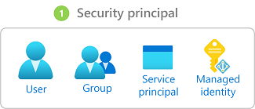
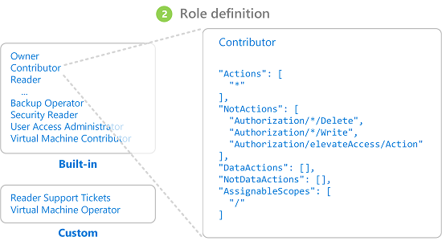

# Manage access

Azure uses [Azure role-based access control](/azure/role-based-access-control/overview) (Azure RBAC) for managing access to Azure resources. It helps you manage who has access to Azure resources, what they can do with those resources, and what areas they can access.

To control access to resources through Azure RBAC, assign Azure roles by using role assignments and role definitions. This is a key concept to understand; it's how permissions are enforced.

You can manage roles and role assignments directly in the Azure portal, or you can use PowerShell, CLI, ARM templates, or REST APIs.

## Role assignment

Role assignments define the resources that users, groups, service principals, and managed identities can access. A role assignment consists of three elements: [security principal](#security-principal), [role definition](#role-definition), and [scope](#scope).

### Security principal

A *security principal* is an object that represents a user, group, service principal, or managed identity requesting access to Azure resources. You can assign a role to any of these security principals. A security principal is either a [user-assigned managed identity](/azure/active-directory/managed-identities-azure-resources/overview) or a [system-assigned managed identity](/azure/active-directory/managed-identities-azure-resources/overview).

### Role definition

A role definition, sometimes called simply a *role*, is a collection of permissions. It lists the actions such as read, write, and delete, that a user is allowed to perform. Roles can be high level, such as Owner, or specific to an Azure managed service.

Azure includes (1) several built-in role definitions you can use and (2) the following three core roles for managing access:

* The [Owner role](/azure/role-based-access-control/built-in-roles#owner) can manage everything, including access to resources.
* The [Contributor role](/azure/role-based-access-control/built-in-roles#contributor) can manage everything except access to resources.
* The [Reader role](/azure/role-based-access-control/built-in-roles#reader) can view everything but not make changes.

> [!Note]
> Here, we are using Azure roles, not Azure Active Directory (Azure AD) roles. To understand the differences and when each role is used, see [Classic subscription administrator roles, Azure roles, and Azure AD roles](/azure/role-based-access-control/rbac-and-directory-admin-roles).

### Scope

*Scope* is the set of resources that the access applies to. When you assign a role, you can further limit the allowed actions by defining a scope. In Azure, you can specify a scope at four levels: management group, subscription, resource group, or resource. For details, see [Understand scope for RBAC](/azure/role-based-access-control/scope-overview).

## Plan your access control strategy

Managing who can access your Azure resources and subscriptions is an important part of your Azure governance strategy. In addition, assigning group-based access rights and privileges is a good practice; dealing with groups instead of individual users simplifies maintenance of access policies, provides consistent management of access across teams, and reduces configuration errors.

When you plan an access control strategy, grant users the least privilege required to get their work done. To learn more about designing access for your studio, see [Cloud Adoption Framework: Azure role-based access control](/azure/cloud-adoption-framework/ready/considerations/roles). For an overview of the Azure RBAC practices that we recommend for inclusion in your identity and security strategy, see [Azure identity management and access control security best practices](/azure/security/fundamentals/identity-management-best-practices#use-role-based-access-control).

## Next steps

* [What is Azure role-based access control](/azure/role-based-access-control/overview)
* [List Azure role assignments using the Azure portal](/azure/role-based-access-control/role-assignments-list-portal)