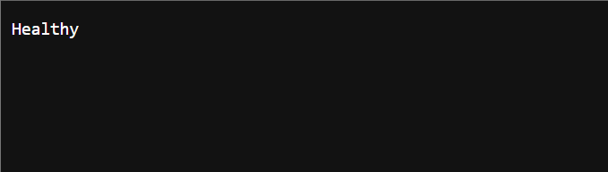

# Post deployment configuration

[!INCLUDE [preview](./includes/preview.md)]

You can either use the following script, or manually complete the configuration in the Azure Portal.

## Azure CLI
```azurecli-interactive
echo "Subscription Name?           (Type and press enter to continue)" && read -r SUBSCRIPTION_NAME
echo "Resource Group Name?         (Type and press enter to continue)" && read -r RG
echo "Managed Resource Group Name? (Type and press enter to continue)" && read -r RESOURCE_GROUP
echo "Managed App Name?            (Type and press enter to continue)" && read -r APP_NAME
echo "Traffic Manager?             (Type and press enter to continue)" && read -r TM_NAME

az account set -s "$SUBSCRIPTION_NAME"
az account show
```

### Setup IP Addresses

```azurecli-interactive
managedResourceGroupId=$(az managedapp show --name $APP_NAME --resource-group $RG --query managedResourceGroupId --output tsv)
resourceGroup=$(echo ${managedResourceGroupId##*/})
nodeResourceGroups=$(az aks list --resource-group $resourceGroup --query [].[nodeResourceGroup] --output tsv)
```

```azurecli-interactive
for nodeResourceGroup in $nodeResourceGroups; do
    ipName=$(az network public-ip list --resource-group $nodeResourceGroup --query "[?contains(name,'kub')].[name]" --output tsv)
    ipID=$(az network public-ip list --resource-group $nodeResourceGroup --query "[?contains(name,'kub')].[id]" --output tsv)
    location=$(az network public-ip list --resource-group $nodeResourceGroup --query "[?contains(name,'kub')].[location]" --output tsv)
    az network public-ip update \
        --name $ipName \
        --dns-name $ipName \
        --resource-group $nodeResourceGroup
    
    az network traffic-manager endpoint create \
        --resource-group $RG \
        --profile-name $TM_NAME \
        -n $location \
        --type azureEndpoints \
        --target-resource-id $ipID \
        --endpoint-status enabled
done
```

### Setup Azure Cosmos DB

```azurecli-interactive
account=$(az cosmosdb list --resource-group $resourceGroup --query [].[name] --output tsv)

declare -A tables=(
    [blob_index]="32000"
    [objects]="4000"
    [buckets]="8000"
    [content_id]="4000"
)

keySpace='jupiter'

for table in ${!tables[@]}; do
    az cosmosdb cassandra table throughput update \
        --account-name $account \
        --resource-group $resourceGroup \
        --keyspace-name $keySpace \
        --name $table \
        --throughput ${tables[${table}]} \
    && az cosmosdb cassandra table throughput migrate \
        --account-name $account \
        --resource-group $resourceGroup \
        --keyspace-name $keySpace \
        --name $table \
        --throughput-type "autoscale"
done

declare -A REGION_TABLES=( \
    [replication_log]="4000" \
    [replication_namespace]="4000" \
)

KEY_VAULTS=$(az keyvault list -g "$resourceGroup" --query [].[name] --output tsv)
for table in ${!REGION_TABLES[@]}; do
    for KEY_VAULT in $KEY_VAULTS; do
        LOCATION=$(echo "$KEY_VAULT" | awk -F'-' '{print $1}')
        az cosmosdb cassandra table throughput update \
            --account-name $account \
            --resource-group $resourceGroup \
            --keyspace-name "${keySpace}_local_${LOCATION}" \
            --name $table \
            --throughput ${REGION_TABLES[${table}]} \
        && az cosmosdb cassandra table throughput migrate \
            --account-name $account \
            --resource-group $resourceGroup \
            --keyspace-name "${keySpace}_local_${LOCATION}" \
            --name $table \
            --throughput-type "autoscale"
    done
done
```

## Azure Portal

### Configure the Public IP Addresses

* Navigate to each Kubernetes service
* In the **Properties** blade, select the **Infrastructure resource group**
* Select the **Public IP Address** resource which starts with _kubernetes-_
* In the **Configuration** blade, provide a DNS name label.

### Connect to Traffic Manager

* Navigate to the Traffic Manager Profile which is registered with your chosen DNS.
* Add each Public IP Address Traffic Manager Profile from the Managed Resource Group as a nested profile.
    * Go to **Settings**>**Endpoint**
    * Select **Add** at the top of the page to start configuring the new endpoint properties
    * Under **Type**, select **Azure endpoint**
    * Under **Target resource type**, select "Public IP Address" and then select the resource name of the public IP address
    * Select the **Add** button to complete
    * Repeat the steps above for each public IP address

### Cosmos DB

Adjust the RUs on Cosmos DB Collections.
If you encounter 429 errors from Cosmos DB when syncing, the values can be increased further.

* **blob_index** 32k RU
* **buckets** 8k RU
* **objects** 4k RU
* **content_id** 4k RU
* **replication_log** 4k RU
* **replication_namespace** 4k RU

## Health test

Test the deployment was successful by navigating to `https://<hostname>/health/live/`. This page should display "healthy", and be secured with your HTTPS certificate. If **Healthy** is not displayed and you need help to debug common issues, see [Troubleshooting and support](troubleshoot-support.md).



## Advanced Configurations

If you would like to further customzie the deployment you can modify the following helm script. This can also be used if the AKS configurations where not properly set during deployment.


### Check Helm Deployment

Check that the Azure Kubernetes Service (AKS) pods have started successfully.
If they have, skip to the next section. Otherwise, use this script. Then, restart the AKS pods.

```azurecli-interactive
echo "Service Principal Client ID? (Type and press enter to continue)" && read -r APP_ID
echo "Worker Client ID?            (Type and press enter to continue)" && read -r WORKER_ID
echo "Hostname?                    (Type and press enter to continue)" && read -r HOSTNAME
echo "Namespace?                   (Type and press enter to continue)" && read -r Namespace

function setup_ddc(){
    # Disable History Expansion for key vault pointers that contain "!" per https://unix.stackexchange.com/a/33341/38809
    set +H
    HELM_CHART='oci://tchordestoragecontainerregistry.azurecr.io/helm/tc-horde-storage'
    HELM_NAME='myhordetest'
    HELM_NAMESPACE='horde-tests'

    TENANT_ID=$(az account show --query "tenantId" --output tsv)
    SUBSCRIPTION_ID=$(az account show --query "id" --output tsv)

    OAuthClient=$APP_ID
    FEDERATED_ID=$(az identity list -g "$RESOURCE_GROUP" --query "[?contains(name,'""$LOCATION""')].[clientId]" --output tsv)

    AzureConnectionString="akv!$KEY_VAULT|horde-storage-connection-string"
    ScyllaConnectionString="akv!$KEY_VAULT|horde-db-connection-string"
    OAuthClientPointer="akv!$KEY_VAULT|build-app-secret"

    declare -A locations=( [eastus]="East US" [westus]="West US" [southcentralus]="South Central US" [japaneast]="Japan East" [australiaeast]="Australia East")
    LocalDatacenterName=${locations[$LOCATION]}
    LocalKeyspaceSuffix=$LOCATION

    helm upgrade $HELM_NAME $HELM_CHART \
        --namespace $HELM_NAMESPACE \
        --set horde-storage.env[0].name=AZURE_CLIENT_ID \
        --set horde-storage.env[0].value="$FEDERATED_ID" \
        --set horde-storage.env[1].name=AZURE_TENANT_ID \
        --set horde-storage.env[1].value="$TENANT_ID" \
        --set horde-storage.env[2].name=AZURE_FEDERATED_TOKEN_FILE, \
        --set horde-storage.env[2].value='/var/run/secrets/tokens/azure-identity-token' \
        --set horde-storage.service.extraPort[0].name="internal-http" \
        --set horde-storage.service.extraPort[0].port="8080" \
        --set horde-storage.service.extraPort[0].targetPort="internal-http" \
        --set horde-storage.config.Azure.ConnectionString="$AzureConnectionString" \
        --set horde-storage.config.Scylla.ConnectionString="$ScyllaConnectionString" \
        --set horde-storage.config.Scylla.LocalDatacenterName="$LocalDatacenterName" \
        --set horde-storage.config.Scylla.LocalKeyspaceSuffix="$LocalKeyspaceSuffix" \
        --set horde-storage.ingress.hostname=$HOSTNAME \
        --set horde-storage.ingress.tlsCertName='unreal-cloud-ddc-cert' \
        --set horde-storage.secretStore.clientID="$FEDERATED_ID" \
        --set horde-storage.secretStore.keyvaultName="$KEY_VAULT" \
        --set horde-storage.secretStore.resourceGroup="$RESOURCE_GROUP" \
        --set horde-storage.secretStore.subscriptionId="$SUBSCRIPTION_ID" \
        --set horde-storage.secretStore.tenantId="$TENANT_ID" \
        --set horde-storage.serviceAccount.annotations.azure\\.workload\\.identity/client-id="$FEDERATED_ID" \
        --set global.ServiceCredentials.OAuthClientId="$WORKER_ID" \
        --set global.ServiceCredentials.OAuthClientSecret="$OAuthClientPointer" \
        --set global.ServiceCredentials.OAuthLoginUrl="https://login.microsoftonline.com/$TENANT_ID/oauth2/v2.0/token" \
        --set global.ServiceCredentials.OAuthScope="api://$OAuthClient/.default" \
        --set global.auth.schemes.Bearer.jwtAuthority="https://login.microsoftonline.com/$TENANT_ID" \
        --set global.auth.schemes.Bearer.jwtAudience="api://$OAuthClient" \
        --set horde-storage.podForceRestart=true \
        --set horde-storage.worker.env[0].name=AZURE_CLIENT_ID \
        --set horde-storage.worker.env[0].value=$FEDERATED_ID \
        --set horde-storage.worker.env[1].name=AZURE_TENANT_ID \
        --set horde-storage.worker.env[1].value=$TENANT_ID \
        --set horde-storage.worker.env[2].name=AZURE_FEDERATED_TOKEN_FILE \
        --set horde-storage.worker.env[2].value=/var/run/secrets/tokens/azure-identity-token \
        --set horde-storage.worker.Replication.Enabled=true \
        --set horde-storage.worker.Replication[0].ReplicatorName=Replicator \
        --set horde-storage.worker.Replication[0].Namespace=$Namespace \
        --set horde-storage.worker.Replication[0].ConnectionString=$HOSTNAME \
        --create-namespace \
        --install
}

KEY_VAULTS=$(az keyvault list -g "$RESOURCE_GROUP" --query [].[name] --output tsv)

for KEY_VAULT in $KEY_VAULTS; do
    LOCATION=$(echo "$KEY_VAULT" | awk -F'-' '{print $1}')
    CLUSTER_NAME="horde-storage-${LOCATION:0:8}"

    az aks get-credentials \
        --resource-group "$RESOURCE_GROUP" \
        --name "$CLUSTER_NAME" \
        --overwrite-existing

    setup_ddc
done
```

## Next steps

* [Unreal Cloud DDC with Visual Studio](integrate-with-vs.md)
* [Unreal Cloud DDC from Game Development VM with Visual Studio](integrate-with-gdvm.md)
