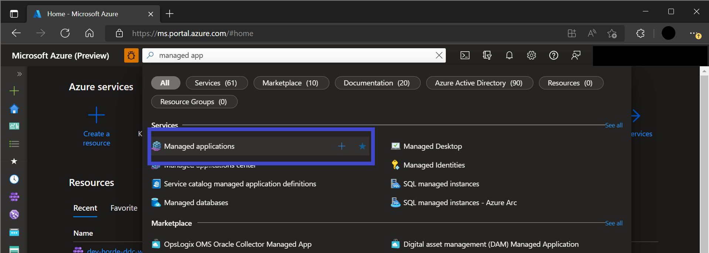
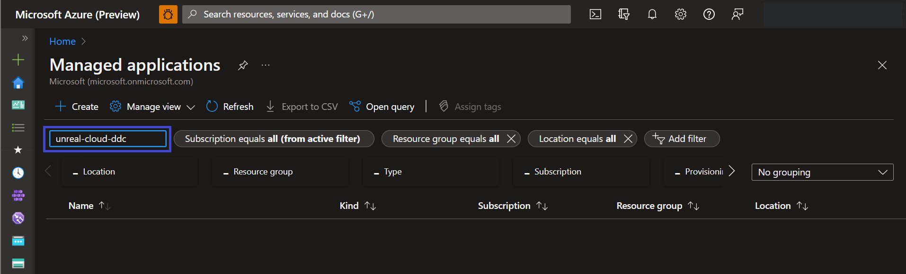

# Create Service Resources for Unreal Cloud DDC 

[!INCLUDE [preview](./includes/preview.md)]

This quickstart describes how to create an Unreal Cloud DDC managed application using the Azure portal.

## Create and configure with basic options

1. Sign in to the [Azure portal](https://portal.azure.com/)
1. Type **Unreal Cloud DDC** in the search field.
1. Select **Unreal Cloud DDC** from the results list.
1. On the **Unreal Cloud DDC** page, select **Create**.
1. Then, provide suitable values for the following parameters:

    * **Subscription**: Choose a subscription.
    * **Resource Group**: Select an existing resource group, or select **Create new** and enter a resource group name.
    * **Region**: Choose a location.
    * **Name**: Enter a unique name.
    * **Agent Pool Count**: Enter the number of nodes.
    * **Agent Pool Name**: Enter a unique name for the Agent pool.

1. Select **Review+Create**. Or select **Next: Advanced** to provide advanced configurations, skip to the next section for instructions.
1. If there are validation issues, fix them and then select **Create**.

## Create and configure with advanced options

The Unreal DDC managed application comes with advanced options to reuse existing Azure resources, or create new ones dedicated for the deployment.

Available resource types: [Azure Storage Account](/azure/storage/blobs/storage-blobs-introduction), [Azure Key Vault](/azure/key-vault/general/overview), [Azure Cosmos DB](/azure/cosmos-db/introduction), and [Azure Virtual Network IP services - Public IP](/azure/virtual-network/ip-services/public-ip-addresses).

> [!NOTE]
> Instructions on how to configure these advanced options will soon be available.

1. On the **Advanced** tab, provide the following inputs:

    * **Use existing Storage Account**: Select if you would like to use an existing storage account. Otherwise a new storage account will be created.
    * **Storage Account Name**: Enter a unique name for a new Storage Account.
    * **Use existing Key Vault**: Select if you would like to use an existing storage account. Otherwise a new new Key Vault will be created.
    * **Key Vault Name**: Enter a unique name for a new Key Vault.
    * **Use existing Cosmos DB**: Select if you would like to use an existing Cosmos DB account. Otherwise a new Cosmos DB will be created.
    * **Cosmos DB Name**: Enter a unique name for a new Cosmos DB.
    * **Use existing Public IP**: Select if you would like to use an existing Public IP address. Otherwise a new Public IP address will be created.
    * **Public IP Name**: Enter a unique name for a new Storage Account.

2. Select **Review+Create**.
3. Validation checks will run. After fixing any issues, select **Create**.

## View the deployment

1. Go to the Azure portal menu or the home page and select **Managed Applications**.

    

1. In the filter box, enter the deployment name and select it.

    

## Clean up

If the deployment is no longer needed, delete it. This will also delete all nested resources within the group. There are several ways to delete the deployment. This is one way to do it.

1. Go to the Azure portal menu or the home page and select **Managed Applications**.
1. In the filter box, enter the deployment name.
1. Select the check box and select **Delete**.
1. Enter **Yes** and select **Delete**.

## Next steps

* [Post deployment configuration to complete setup](deployment-setup.md)

## See also

* [Azure portal how-to video series](/azure/azure-portal/azure-portal-video-series)
* [Manage Azure portal settings and preferences](/azure/azure-portal/set-preferences)
* [Create a dashboard in the Azure portal](/azure/azure-portal/azure-portal-dashboards)
* [Create an Azure portal dashboard with Azure CLI](/azure/azure-portal/quickstart-portal-dashboard-azure-cli)
* [Get subscription and tenant IDs in the Azure portal](/azure/azure-portal/get-subscription-tenant-id)
