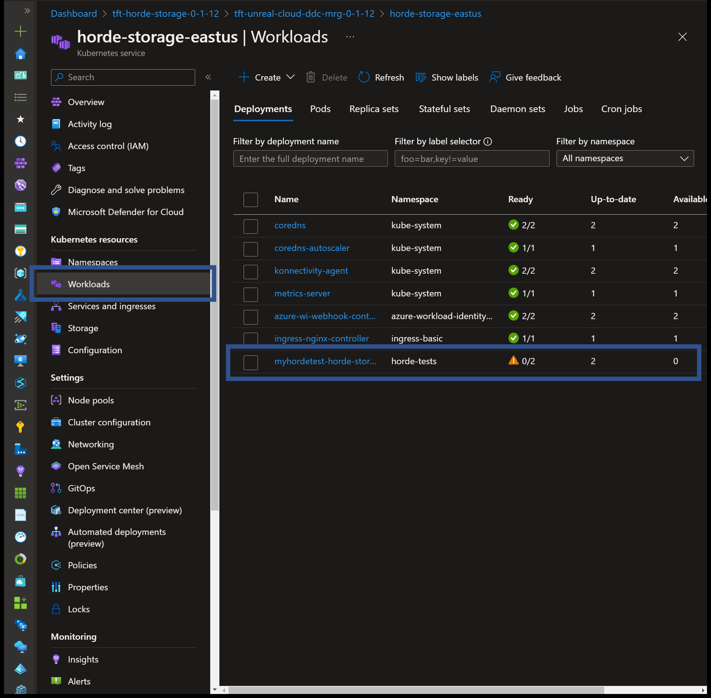

# Troubleshooting and support

[!INCLUDE [preview](./includes/preview.md)]

This article describes common support issues that customers might experience, and guidance from us about how to resolve them.

Unreal Cloud DDC is built on top of core Azure services, such as Azure Kubernetes Service (AKS) and Azure Cosmos DB, which allows you to leverage support directly for any of these services.

For more details about how to get support with your Azure resources, see [Azure support FAQ](https://azure.microsoft.com/support/faq/#support-overview).

## Unreal Cloud DDC Pod repeatedly restarts

The AKS Pod may repeated restart if it has not been properly configured.

This may occur if AKS fails to connect to Key Vault, or if any of the secrets in Key Vault are invalid.

Checking the `Event Logs` for the pod may be helpful. You may also try to `Delete` an existing pod, and load the `Live View` of a new Pod.

First, confirm that the Service Principal used during deployment is a 'Key Vault Administrator', and that the secrets which contain this password are properly configured. Also, confirm that the Federated Credential for the Service Principal was successfully created.

If after restarting the pods they are still continuing to reset, check that both the **Storage Account Key** and **Cassandra DB keys** are correct.

## Unable to access certificate

```yaml
reason: FailedMount
message: >-
  MountVolume.SetUp failed for volume "secrets-store-inline" : rpc error: code = Unknown desc = failed to mount secrets store objects for pod horde-tests/myhordetest-horde-storage-fbd9b48fb-m9dl2, err: rpc error: code = Unknown desc = failed to mount objects, error: failed to get objectType:secret, objectName:horde-storage-cert, objectVersion:: keyvault.BaseClient#GetSecret: Failure responding to request: StatusCode=403
  -- Original Error: autorest/azure: Service returned an error.
  Status=403
  Code="Forbidden"
  Message="Caller is not authorized to perform action on resource. If role assignments, deny assignments or role definitions were changed recently, please observe propagation time.
  Caller: appid=63af6de1-b382-4cea-b535-3520e1686737;oid=5d738b2f-e899-4eff-b4b1-1c00ac9ad8a6;iss=https://sts.windows.net/72f988bf-86f1-41af-91ab-2d7cd011db47/
  Action: 'Microsoft.KeyVault/vaults/secrets/getSecret/action'
  Resource: '/subscriptions/69c75911-7439-4362-855d-c8f3ecbbf3de/resourcegroups/tc-horde-storage-mrg-1-0-500/providers/microsoft.keyvault/vaults/westus-kymj3tigzywca/secrets/horde-storage-cert'
  Assignment: (not found)
  Vault: westus-kymj3tigzywca;location=westus
  InnerError={"code":"ForbiddenByRbac"}
```

Confirm the value of `horde-storage.serviceAccount.annotations.azure.workload.identity/client-id` is set correctly.

## No server certificate was specified

```json
{
  "Timestamp": "2022-10-13T18:56:43.4101099Z",
  "EventId": 15,
  "LogLevel": "Error",
  "Category": "Microsoft.Diagnostics.Tools.Monitor.Startup",
  "Message": "Unable to listen to https://+:52323. Dotnet-monitor functionality will be limited.",
  "Exception": "System.InvalidOperationException: Unable to configure HTTPS endpoint. No server certificate was specified, and the default developer certificate could not be found or is out of date. To generate a developer certificate run 'dotnet dev-certs https'. To trust the certificate (Windows and macOS only) run 'dotnet dev-certs https --trust'. For more information on configuring HTTPS see https://go.microsoft.com/fwlink/?linkid=848054. at Microsoft.AspNetCore.Hosting.ListenOptionsHttpsExtensions.UseHttps(ListenOptions listenOptions, Action`1 configureOptions) at Microsoft.AspNetCore.Hosting.ListenOptionsHttpsExtensions.UseHttps(ListenOptions listenOptions) at Microsoft.Diagnostics.Tools.Monitor.AddressListenResults.<>c__DisplayClass10_0.<Listen>b__0(ListenOptions listenOptions) in /_/src/Tools/dotnet-monitor/AddressListenResults.cs:line 87 at Microsoft.AspNetCore.Server.Kestrel.Core.KestrelServerOptions.ListenAnyIP(Int32 port, Action`1 configure) at Microsoft.Diagnostics.Tools.Monitor.AddressListenResults.Listen(KestrelServerOptions options, String url) in /_/src/Tools/dotnet-monitor/AddressListenResults.cs:line 103",
  "State": {
    "Message": "Unable to listen to https://+:52323. Dotnet-monitor functionality will be limited.",
    "url": "https://+:52323",
    "{OriginalFormat}": "Unable to listen to {url}. Dotnet-monitor functionality will be limited."
  },
  "Scopes": []
}
```

Rerun Secret Store helm setup.

### Failed attach volume

```yaml
reason: FailedAttachVolume
message: >-
  Multi-Attach error for volume "pvc-aebe3a39-f814-43c6-a5fa-d6795bf85982"
  Volume is already exclusively attached to one node and can't be attached to
  another
```

Check that persistance is set to false.

### Federated identity issues

The following FailMount error message is found in the "Events" section.

```yaml
reason: FailedMount
message: >-
  MountVolume.SetUp failed for volume "secrets-store-inline" : rpc error: code =
  Unknown desc = failed to mount secrets store objects for pod
  horde-tests/myhordetest-horde-storage-fbd9b48fb-m9dl2, err: rpc error: code =
  Unknown desc = failed to mount objects, error: failed to get keyvault client:
  failed to get authorizer for keyvault client: failed to acquire token:
  FromAssertion(): http
  call(https://login.microsoftonline.com/72f988bf-86f1-41af-91ab-2d7cd011db47/oauth2/v2.0/token)(POST)
  error: reply status code was 400:

  {"error":"invalid_request","error_description":"AADSTS70021: No matching
  federated identity record found for presented assertion. Assertion Issuer:
  'https://westus.oic.prod-aks.azure.com/72f988bf-86f1-41af-91ab-2d7cd011db47/f4229245-74d4-4051-ba65-77748d7bade4/'.
  Assertion Subject: 'system:serviceaccount:horde-tests:workload-identity-sa'.
  Assertion Audience: 'api://AzureADTokenExchange'.
  https://docs.microsoft.com/en-us/azure/active-directory/develop/workload-identity-federation\r\nTrace
  ID: 2b43378a-5cdb-4034-8965-f77143ff1200\r\nCorrelation ID:
  7e4c72c4-32e7-41b1-87d4-931ecc1f2748\r\nTimestamp: 2022-10-04
  01:08:02Z","error_codes":[70021],"timestamp":"2022-10-04
  01:08:02Z","trace_id":"2b43378a-5cdb-4034-8965-f77143ff1200","correlation_id":"7e4c72c4-32e7-41b1-87d4-931ecc1f2748","error_uri":"https://login.microsoftonline.com/error?code=70021"}
```

The Helm configuration may be incorrect.

1. Confirm the value of `horde-storage.secretStore.clientID`
1. Confirm the Client has proper permission on Key Vault to access secrets.
1. Confirm that all secrets are in the key vault.
1. Rerun helm scripts

The following fatal error may appear in the live events.

```yml
Timestamp: "2022-10-12T18:28:39.3407223+00:00"
Level: "Fatal"
MessageTemplate: "Host terminated unexpectedly"
Properties:
  dd_service: "horde-storage"
  dd_version: "0.36.1"
  dd_env    : "dev"
Exception:
    - AuthenticationFailedException:
        AADSTS70021       : 'No matching federated identity record found for presented assertion.'
        Assertion_Issuer  : 'https://southcentralus.oic.prod-aks.azure.com/72f988bf-86f1-41af-91ab-2d7cd011db47/f663fe3f-abdf-4e1e-8fda-ca61bf21c745/'
        Assertion_Subject : 'system:serviceaccount:horde-tests:workload-identity-sa'
        Assertion_Audience: 'api://AzureADTokenExchange'
      Trace_ID      : '2cebcb3e-3d8b-4aa4-b0e9-6d20d3a72a00'
      Correlation_ID: 'ff6f92ca-ce44-4db2-b947-ea7428fe2c18'
      Timestamp     : '2022-10-12 18:28:39Z'
    - MsalServiceException:
        ErrorCode         : 'invalid_request'
        AADSTS70021       : 'No matching federated identity record found for presented assertion.'
        Assertion_Issuer  : 'https://southcentralus.oic.prod-aks.azure.com/72f988bf-86f1-41af-91ab-2d7cd011db47/f663fe3f-abdf-4e1e-8fda-ca61bf21c745/'
        Assertion_Subject : 'system:serviceaccount:horde-tests:workload-identity-sa'
        Assertion_Audience: 'api://AzureADTokenExchange'
      Trace_ID      : '2cebcb3e-3d8b-4aa4-b0e9-6d20d3a72a00'
      Correlation_ID: 'ff6f92ca-ce44-4db2-b947-ea7428fe2c18'
      Timestamp     : '2022-10-12 18:28:39Z'
      StackTrace    : |
           at Microsoft.Identity.Client.Internal.Requests.RequestBase.HandleTokenRefreshError(MsalServiceException e, MsalAccessTokenCacheItem cachedAccessTokenItem)
           ...
           at Azure.Identity.ClientAssertionCredential.GetToken(TokenRequestContext requestContext, CancellationToken cancellationToken)
      StatusCode: 400 
      ResponseBody: 
          error: "invalid_request",
          error_description:
              AuthenticationFailedException:
                  AADSTS70021       : 'No matching federated identity record found for presented assertion.'
                  Assertion_Issuer  : 'https://southcentralus.oic.prod-aks.azure.com/72f988bf-86f1-41af-91ab-2d7cd011db47/f663fe3f-abdf-4e1e-8fda-ca61bf21c745/'
                  Assertion_Subject : 'system:serviceaccount:horde-tests:workload-identity-sa'
                  Assertion_Audience: 'api://AzureADTokenExchange'
              Trace_ID                 : '2cebcb3e-3d8b-4aa4-b0e9-6d20d3a72a00'
              Correlation_ID           : 'ff6f92ca-ce44-4db2-b947-ea7428fe2c18'
              Timestamp                : '2022-10-12 18:28:39Z'
              error_codes              : '[70021]'
              timestamp                : '2022-10-12 18:28:39Z'
              trace_id                 : '2cebcb3e-3d8b-4aa4-b0e9-6d20d3a72a00'
              correlation_id           : 'ff6f92ca-ce44-4db2-b947-ea7428fe2c18'
              error_uri                : 'https://login.microsoftonline.com/error?code=70021'
              Headers                  : "Cache-Control: 'no-store, no-cache'"
              Pragma                   : 'no-cache'
              Strict-Transport-Security: 'max-age=31536000; includeSubDomains'
              X-Content-Type-Options   : 'nosniff'
              P3P                      : 'CP="DSP CUR OTPi IND OTRi ONL FIN"'
              client-request-id        : 'ff6f92ca-ce44-4db2-b947-ea7428fe2c18'
              x-ms-request-id          : '2cebcb3e-3d8b-4aa4-b0e9-6d20d3a72a00'
              x-ms-ests-server         : '2.1.13871.7 - EUS ProdSlices'
              x-ms-clitelem            : '1,70021,0,,'
              X-XSS-Protection         : '0'
              Set-Cookie               : 'fpc=AiI-4h-MiA1ElIF5qHSnGpSmWg-RAQAAAFf-2NoOAAAA; expires=Fri, 11-Nov-2022 18:28:39 GMT; path=/; secure; HttpOnly; SameSite=None, x-ms-gateway-slice=estsfd; path=/; secure; samesite=none; httponly, stsservicecookie=estsfd; path=/; secure; samesite=none; httponly'
              Date                     : 'Wed, 12 Oct 2022 18:28:39 GMT'
              stackTrace               : |				
                   --- End of inner exception stack trace ---
                   at Azure.Identity.CredentialDiagnosticScope.FailWrapAndThrow(Exception ex, String additionalMessage)
                   ...
                   at Jupiter.BaseProgram`1.BaseMain(String[] args) in /app/Programs/Horde/HordeStorage/Jupiter.Common/BaseProgram.cs:line 54

```

Confirm the value of APP_ID variable is correctly set in the pod.

## Health URL returns 404

When trying to reach your Unreal Cloud DDC, a common issue you may experience is receiving a **404 Not Found** error returned by nginx.

The error page may occur if you are trying to access AKS directly from the Public IP address or the Traffic Manager DNS.

* Ensure that you are using both `https`, and the `hostname` provided during deployment.
* The URL should be in the format, `https://<hostname>/health/live`, which should return "Healthy".

### Host terminated unexpectedly

```json
{
  "Timestamp": "2022-10-13T17:34:57.4524551+00:00",
  "Level": "Fatal",
  "MessageTemplate": "Host terminated unexpectedly",
  "Exception": "System.Net.Internals.SocketExceptionFactory+ExtendedSocketException (00000005, 0xFFFDFFFF): Name or service not known\n at System.Net.Dns.GetHostEntryOrAddressesCore(String hostName, Boolean justAddresses, AddressFamily addressFamily, ValueStopwatch stopwatch)\n at System.Net.Dns.GetHostAddresses(String hostNameOrAddress, AddressFamily family)\n at Horde.Storage.HordeStorageStartup.ScyllaFactory(IServiceProvider provider) in /app/Programs/Horde/HordeStorage/Horde.Storage/Horde.Storage.Startup.cs:line 307\n at Microsoft.Extensions.DependencyInjection.ServiceLookup.CallSiteVisitor`2.VisitCallSiteMain(ServiceCallSite callSite, TArgument argument)\n at Microsoft.Extensions.DependencyInjection.ServiceLookup.CallSiteRuntimeResolver.VisitRootCache(ServiceCallSite callSite, RuntimeResolverContext context)\n at Microsoft.Extensions.DependencyInjection.ServiceLookup.CallSiteVisitor`2.VisitCallSite(ServiceCallSite callSite, TArgument argument)\n at Microsoft.Extensions.DependencyInjection.ServiceLookup.CallSiteRuntimeResolver.Resolve(ServiceCallSite callSite, ServiceProviderEngineScope scope)\n at Microsoft.Extensions.DependencyInjection.ServiceProvider.CreateServiceAccessor(Type serviceType)\n at System.Collections.Concurrent.ConcurrentDictionary`2.GetOrAdd(TKey key, Func`2 valueFactory)\n at Microsoft.Extensions.DependencyInjection.ServiceProvider.GetService(Type serviceType, ServiceProviderEngineScope serviceProviderEngineScope)\n at Microsoft.Extensions.DependencyInjection.ServiceLookup.ServiceProviderEngineScope.GetService(Type serviceType)\n at Microsoft.Extensions.DependencyInjection.ActivatorUtilities.ConstructorMatcher.CreateInstance(IServiceProvider provider)\n at Microsoft.Extensions.DependencyInjection.ActivatorUtilities.CreateInstance(IServiceProvider provider, Type instanceType, Object[] parameters)\n at Microsoft.Extensions.DependencyInjection.ActivatorUtilities.CreateInstance[T](IServiceProvider provider, Object[] parameters)\n at Horde.Storage.HordeStorageStartup.ObjectStoreFactory(IServiceProvider provider) in /app/Programs/Horde/HordeStorage/Horde.Storage/Horde.Storage.Startup.cs:line 372\n at Microsoft.Extensions.DependencyInjection.ServiceLookup.CallSiteVisitor`2.VisitCallSiteMain(ServiceCallSite callSite, TArgument argument)\n at Microsoft.Extensions.DependencyInjection.ServiceLookup.CallSiteRuntimeResolver.VisitRootCache(ServiceCallSite callSite, RuntimeResolverContext context)\n at Microsoft.Extensions.DependencyInjection.ServiceLookup.CallSiteVisitor`2.VisitCallSite(ServiceCallSite callSite, TArgument argument)\n at Microsoft.Extensions.DependencyInjection.ServiceLookup.CallSiteRuntimeResolver.VisitConstructor(ConstructorCallSite constructorCallSite, RuntimeResolverContext context)\n at Microsoft.Extensions.DependencyInjection.ServiceLookup.CallSiteVisitor`2.VisitCallSiteMain(ServiceCallSite callSite, TArgument argument)\n at Microsoft.Extensions.DependencyInjection.ServiceLookup.CallSiteRuntimeResolver.VisitRootCache(ServiceCallSite callSite, RuntimeResolverContext context)\n at Microsoft.Extensions.DependencyInjection.ServiceLookup.CallSiteVisitor`2.VisitCallSite(ServiceCallSite callSite, TArgument argument)\n at Microsoft.Extensions.DependencyInjection.ServiceLookup.CallSiteRuntimeResolver.Resolve(ServiceCallSite callSite, ServiceProviderEngineScope scope)\n at Microsoft.Extensions.DependencyInjection.ServiceProvider.CreateServiceAccessor(Type serviceType)\n at System.Collections.Concurrent.ConcurrentDictionary`2.GetOrAdd(TKey key, Func`2 valueFactory)\n at Microsoft.Extensions.DependencyInjection.ServiceProvider.GetService(Type serviceType, ServiceProviderEngineScope serviceProviderEngineScope)\n at Microsoft.Extensions.DependencyInjection.ServiceLookup.ServiceProviderEngineScope.GetService(Type serviceType)\n at Microsoft.Extensions.DependencyInjection.ServiceProviderServiceExtensions.GetService[T](IServiceProvider provider)\n at Horde.Storage.HordeStorageStartup.<>c.<OnAddService>b__2_13(IServiceProvider p) in /app/Programs/Horde/HordeStorage/Horde.Storage/Horde.Storage.Startup.cs:line 158\n at Microsoft.Extensions.DependencyInjection.ServiceLookup.CallSiteVisitor`2.VisitCallSiteMain(ServiceCallSite callSite, TArgument argument)\n at Microsoft.Extensions.DependencyInjection.ServiceLookup.CallSiteRuntimeResolver.VisitRootCache(ServiceCallSite callSite, RuntimeResolverContext context)\n at Microsoft.Extensions.DependencyInjection.ServiceLookup.CallSiteVisitor`2.VisitCallSite(ServiceCallSite callSite, TArgument argument)\n at Microsoft.Extensions.DependencyInjection.ServiceLookup.CallSiteRuntimeResolver.VisitIEnumerable(IEnumerableCallSite enumerableCallSite, RuntimeResolverContext context)\n at Microsoft.Extensions.DependencyInjection.ServiceLookup.CallSiteVisitor`2.VisitCallSiteMain(ServiceCallSite callSite, TArgument argument)\n at Microsoft.Extensions.DependencyInjection.ServiceLookup.CallSiteRuntimeResolver.VisitRootCache(ServiceCallSite callSite, RuntimeResolverContext context)\n at Microsoft.Extensions.DependencyInjection.ServiceLookup.CallSiteVisitor`2.VisitCallSite(ServiceCallSite callSite, TArgument argument)\n at Microsoft.Extensions.DependencyInjection.ServiceLookup.CallSiteRuntimeResolver.Resolve(ServiceCallSite callSite, ServiceProviderEngineScope scope)\n at Microsoft.Extensions.DependencyInjection.ServiceProvider.CreateServiceAccessor(Type serviceType)\n at System.Collections.Concurrent.ConcurrentDictionary`2.GetOrAdd(TKey key, Func`2 valueFactory)\n at Microsoft.Extensions.DependencyInjection.ServiceProvider.GetService(Type serviceType, ServiceProviderEngineScope serviceProviderEngineScope)\n at Microsoft.Extensions.DependencyInjection.ServiceProvider.GetService(Type serviceType)\n at Microsoft.Extensions.DependencyInjection.ServiceProviderServiceExtensions.GetService[T](IServiceProvider provider)\n at Microsoft.Extensions.Hosting.Internal.Host.StartAsync(CancellationToken cancellationToken)\n at Microsoft.Extensions.Hosting.HostingAbstractionsHostExtensions.RunAsync(IHost host, CancellationToken token)\n at Microsoft.Extensions.Hosting.HostingAbstractionsHostExtensions.RunAsync(IHost host, CancellationToken token)\n at Microsoft.Extensions.Hosting.HostingAbstractionsHostExtensions.Run(IHost host)\n at Jupiter.BaseProgram`1.BaseMain(String[] args) in /app/Programs/Horde/HordeStorage/Jupiter.Common/BaseProgram.cs:line 54",
  "Properties": {
    "dd_service": "horde-storage",
    "dd_version": "0.36.1",
    "dd_env": "dev"
  }
}
```

Check that the value of the Cassandra DB key is correct in Key Vault.

## Incorrect Key Vault name

```yaml
reason: FailedMount
message: >-
  MountVolume.SetUp failed for volume "secrets-store-inline" : rpc error: code =
  Unknown desc = failed to mount secrets store objects for pod
  horde-tests/myhordetest-horde-storage-cff4f8b75-lvwnc, err: rpc error: code =
  Unknown desc = failed to mount objects, error: failed to get vault: Invalid
  vault name: "southcentralus-xy5unuhdvwa36", must be between 3 and 24 chars
```

Confirm that the Key Vault name is correct in the Helm configurations.

## Missing Key Vault Secret

```json
{
  "Timestamp": "2022-10-14T01:11:23.6860774+00:00",
  "Level": "Fatal",
  "MessageTemplate": "Host terminated unexpectedly",
  "Exception": "Azure.RequestFailedException: A secret with (name/id) build-app-secret was not found in this key vault. If you recently deleted this secret you may be able to recover it using the correct recovery command. For help resolving this issue, please see https://go.microsoft.com/fwlink/?linkid=2125182\nStatus: 404 (Not Found)\nErrorCode: SecretNotFound\n\nContent:\n{\"error\":{\"code\":\"SecretNotFound\",\"message\":\"A secret with (name/id) build-app-secret was not found in this key vault. If you recently deleted this secret you may be able to recover it using the correct recovery command. For help resolving this issue, please see https://go.microsoft.com/fwlink/?linkid=2125182\"}}\n\nHeaders:\nCache-Control: no-cache\nPragma: no-cache\nx-ms-keyvault-region: westus\nx-ms-client-request-id: 8dd1a6d3-f963-435d-9b5b-197a49b4a055\nx-ms-request-id: 0fffa66b-4a6f-40e3-80dc-d482510d333d\nx-ms-keyvault-service-version: 1.9.538.1\nx-ms-keyvault-network-info: conn_type=Ipv4;addr=20.245.225.173;act_addr_fam=InterNetwork;\nx-ms-keyvault-rbac-assignment-id: REDACTED\nx-ms-keyvault-rbac-cache: REDACTED\nX-Content-Type-Options: REDACTED\nStrict-Transport-Security: REDACTED\nDate: Fri, 14 Oct 2022 01:11:23 GMT\nContent-Length: 313\nContent-Type: application/json; charset=utf-8\nExpires: -1\n\n at Azure.Security.KeyVault.KeyVaultPipeline.SendRequest(Request request, CancellationToken cancellationToken)\n at Azure.Security.KeyVault.KeyVaultPipeline.SendRequest[TResult](RequestMethod method, Func`1 resultFactory, CancellationToken cancellationToken, String[] path)\n at Azure.Security.KeyVault.Secrets.SecretClient.GetSecret(String name, String version, CancellationToken cancellationToken)\n at Jupiter.Common.Implementation.SecretResolver.ResolveAKVSecret(String providerPath) in /app/Programs/Horde/HordeStorage/Jupiter.Common/Implementation/SecretResolver.cs:line 124\n at Jupiter.Common.Implementation.SecretResolver.ResolveUsingProvider(String providerId, String providerPath, String originalValue) in /app/Programs/Horde/HordeStorage/Jupiter.Common/Implementation/SecretResolver.cs:line 53\n at Jupiter.Common.Implementation.SecretResolver.Resolve(String value) in /app/Programs/Horde/HordeStorage/Jupiter.Common/Implementation/SecretResolver.cs:line 40\n at Horde.Storage.Implementation.ServiceCredentials..ctor(IServiceProvider provider, IOptionsMonitor`1 settings, ISecretResolver secretResolver) in /app/Programs/Horde/HordeStorage/Horde.Storage/Implementation/ServiceCredentials.cs:line 35\n at System.RuntimeMethodHandle.InvokeMethod(Object target, Span`1& arguments, Signature sig, Boolean constructor, Boolean wrapExceptions)\n at System.Reflection.RuntimeConstructorInfo.Invoke(BindingFlags invokeAttr, Binder binder, Object[] parameters, CultureInfo culture)\n at Microsoft.Extensions.DependencyInjection.ActivatorUtilities.ConstructorMatcher.CreateInstance(IServiceProvider provider)\n at Microsoft.Extensions.DependencyInjection.ActivatorUtilities.CreateInstance(IServiceProvider provider, Type instanceType, Object[] parameters)\n at Microsoft.Extensions.DependencyInjection.ActivatorUtilities.CreateInstance[T](IServiceProvider provider, Object[] parameters)\n at Horde.Storage.HordeStorageStartup.<>c.<OnAddService>b__2_14(IServiceProvider p) in /app/Programs/Horde/HordeStorage/Horde.Storage/Horde.Storage.Startup.cs:line 160\n at Microsoft.Extensions.DependencyInjection.ServiceLookup.CallSiteVisitor`2.VisitCallSiteMain(ServiceCallSite callSite, TArgument argument)\n at Microsoft.Extensions.DependencyInjection.ServiceLookup.CallSiteRuntimeResolver.VisitRootCache(ServiceCallSite callSite, RuntimeResolverContext context)\n at Microsoft.Extensions.DependencyInjection.ServiceLookup.CallSiteVisitor`2.VisitCallSite(ServiceCallSite callSite, TArgument argument)\n at Microsoft.Extensions.DependencyInjection.ServiceLookup.CallSiteRuntimeResolver.VisitConstructor(ConstructorCallSite constructorCallSite, RuntimeResolverContext context)\n at Microsoft.Extensions.DependencyInjection.ServiceLookup.CallSiteVisitor`2.VisitCallSiteMain(ServiceCallSite callSite, TArgument argument)\n at Microsoft.Extensions.DependencyInjection.ServiceLookup.CallSiteRuntimeResolver.VisitRootCache(ServiceCallSite callSite, RuntimeResolverContext context)\n at Microsoft.Extensions.DependencyInjection.ServiceLookup.CallSiteVisitor`2.VisitCallSite(ServiceCallSite callSite, TArgument argument)\n at Microsoft.Extensions.DependencyInjection.ServiceLookup.CallSiteRuntimeResolver.VisitConstructor(ConstructorCallSite constructorCallSite, RuntimeResolverContext context)\n at Microsoft.Extensions.DependencyInjection.ServiceLookup.CallSiteVisitor`2.VisitCallSiteMain(ServiceCallSite callSite, TArgument argument)\n at Microsoft.Extensions.DependencyInjection.ServiceLookup.CallSiteRuntimeResolver.VisitRootCache(ServiceCallSite callSite, RuntimeResolverContext context)\n at Microsoft.Extensions.DependencyInjection.ServiceLookup.CallSiteVisitor`2.VisitCallSite(ServiceCallSite callSite, TArgument argument)\n at Microsoft.Extensions.DependencyInjection.ServiceLookup.CallSiteRuntimeResolver.Resolve(ServiceCallSite callSite, ServiceProviderEngineScope scope)\n at Microsoft.Extensions.DependencyInjection.ServiceProvider.CreateServiceAccessor(Type serviceType)\n at System.Collections.Concurrent.ConcurrentDictionary`2.GetOrAdd(TKey key, Func`2 valueFactory)\n at Microsoft.Extensions.DependencyInjection.ServiceProvider.GetService(Type serviceType, ServiceProviderEngineScope serviceProviderEngineScope)\n at Microsoft.Extensions.DependencyInjection.ServiceLookup.ServiceProviderEngineScope.GetService(Type serviceType)\n at Microsoft.Extensions.DependencyInjection.ServiceProviderServiceExtensions.GetService[T](IServiceProvider provider)\n at Horde.Storage.HordeStorageStartup.<>c.<OnAddService>b__2_18(IServiceProvider p) in /app/Programs/Horde/HordeStorage/Horde.Storage/Horde.Storage.Startup.cs:line 172\n at Microsoft.Extensions.DependencyInjection.ServiceLookup.CallSiteVisitor`2.VisitCallSiteMain(ServiceCallSite callSite, TArgument argument)\n at Microsoft.Extensions.DependencyInjection.ServiceLookup.CallSiteRuntimeResolver.VisitRootCache(ServiceCallSite callSite, RuntimeResolverContext context)\n at Microsoft.Extensions.DependencyInjection.ServiceLookup.CallSiteVisitor`2.VisitCallSite(ServiceCallSite callSite, TArgument argument)\n at Microsoft.Extensions.DependencyInjection.ServiceLookup.CallSiteRuntimeResolver.VisitIEnumerable(IEnumerableCallSite enumerableCallSite, RuntimeResolverContext context)\n at Microsoft.Extensions.DependencyInjection.ServiceLookup.CallSiteVisitor`2.VisitCallSiteMain(ServiceCallSite callSite, TArgument argument)\n at Microsoft.Extensions.DependencyInjection.ServiceLookup.CallSiteRuntimeResolver.VisitRootCache(ServiceCallSite callSite, RuntimeResolverContext context)\n at Microsoft.Extensions.DependencyInjection.ServiceLookup.CallSiteVisitor`2.VisitCallSite(ServiceCallSite callSite, TArgument argument)\n at Microsoft.Extensions.DependencyInjection.ServiceLookup.CallSiteRuntimeResolver.Resolve(ServiceCallSite callSite, ServiceProviderEngineScope scope)\n at Microsoft.Extensions.DependencyInjection.ServiceProvider.CreateServiceAccessor(Type serviceType)\n at System.Collections.Concurrent.ConcurrentDictionary`2.GetOrAdd(TKey key, Func`2 valueFactory)\n at Microsoft.Extensions.DependencyInjection.ServiceProvider.GetService(Type serviceType, ServiceProviderEngineScope serviceProviderEngineScope)\n at Microsoft.Extensions.DependencyInjection.ServiceProvider.GetService(Type serviceType)\n at Microsoft.Extensions.DependencyInjection.ServiceProviderServiceExtensions.GetService[T](IServiceProvider provider)\n at Microsoft.Extensions.Hosting.Internal.Host.StartAsync(CancellationToken cancellationToken)\n at Microsoft.Extensions.Hosting.HostingAbstractionsHostExtensions.RunAsync(IHost host, CancellationToken token)\n at Microsoft.Extensions.Hosting.HostingAbstractionsHostExtensions.RunAsync(IHost host, CancellationToken token)\n at Microsoft.Extensions.Hosting.HostingAbstractionsHostExtensions.Run(IHost host)\n at Jupiter.BaseProgram`1.BaseMain(String[] args) in /app/Programs/Horde/HordeStorage/Jupiter.Common/BaseProgram.cs:line 54",
  "Properties": {
    "dd_service": "Horde.Storage",
    "dd_version": "",
    "dd_env": ""
  }
}
```

Check that the required keys are in the Key Vault.

## Could not find a part of the path '/var/run/secrets/azure/tokens/azure-identity-token

```json
{
  "Timestamp": "2022-10-15T01:56:33.0231662+00:00",
  "Level": "Fatal",
  "MessageTemplate": "Host terminated unexpectedly",
  "Exception": "Azure.Identity.AuthenticationFailedException: ClientAssertionCredential authentication failed: Could not find a part of the path '/var/run/secrets/azure/tokens/azure-identity-token'.\n ---> System.IO.DirectoryNotFoundException: Could not find a part of the path '/var/run/secrets/azure/tokens/azure-identity-token'.\n at Interop.ThrowExceptionForIoErrno(ErrorInfo errorInfo, String path, Boolean isDirectory, Func`2 errorRewriter)\n at Microsoft.Win32.SafeHandles.SafeFileHandle.Open(String path, OpenFlags flags, Int32 mode)\n at Microsoft.Win32.SafeHandles.SafeFileHandle.Open(String fullPath, FileMode mode, FileAccess access, FileShare share, FileOptions options, Int64 preallocationSize)\n at System.IO.Strategies.OSFileStreamStrategy..ctor(String path, FileMode mode, FileAccess access, FileShare share, FileOptions options, Int64 preallocationSize)\n at System.IO.Strategies.FileStreamHelpers.ChooseStrategy(FileStream fileStream, String path, FileMode mode, FileAccess access, FileShare share, Int32 bufferSize, FileOptions options, Int64 preallocationSize)\n at System.IO.StreamReader.ValidateArgsAndOpenPath(String path, Encoding encoding, Int32 bufferSize)\n at System.IO.File.InternalReadAllText(String path, Encoding encoding)\n at System.IO.File.ReadAllText(String path)\n at Azure.Identity.TokenExchangeManagedIdentitySource.TokenFileCache.GetTokenFileContents()\n at Microsoft.Identity.Client.Internal.Requests.ClientCredentialHelper.CreateClientCredentialBodyParameters(ICoreLogger logger, ICryptographyManager cryptographyManager, ClientCredentialWrapper clientCredential, String clientId, AuthorityEndpoints endpoints, Boolean sendX5C)\n at Microsoft.Identity.Client.OAuth2.TokenClient.AddBodyParamsAndHeaders(IDictionary`2 additionalBodyParameters, String scopes)\n at Microsoft.Identity.Client.OAuth2.TokenClient.SendTokenRequestAsync(IDictionary`2 additionalBodyParameters, String scopeOverride, String tokenEndpointOverride, CancellationToken cancellationToken)\n at Microsoft.Identity.Client.Internal.Requests.ClientCredentialRequest.FetchNewAccessTokenAsync(CancellationToken cancellationToken)\n at Microsoft.Identity.Client.Internal.Requests.ClientCredentialRequest.ExecuteAsync(CancellationToken cancellationToken)\n at Microsoft.Identity.Client.Internal.Requests.RequestBase.RunAsync(CancellationToken cancellationToken)\n at Microsoft.Identity.Client.ApiConfig.Executors.ConfidentialClientExecutor.ExecuteAsync(AcquireTokenCommonParameters commonParameters, AcquireTokenForClientParameters clientParameters, CancellationToken cancellationToken)\n at Azure.Identity.AbstractAcquireTokenParameterBuilderExtensions.ExecuteAsync[T](AbstractAcquireTokenParameterBuilder`1 builder, Boolean async, CancellationToken cancellationToken)\n at Azure.Identity.MsalConfidentialClient.AcquireTokenForClientAsync(String[] scopes, String tenantId, Boolean async, CancellationToken cancellationToken)\n at Azure.Core.Pipeline.TaskExtensions.EnsureCompleted[T](ValueTask`1 task)\n at Azure.Identity.ClientAssertionCredential.GetToken(TokenRequestContext requestContext, CancellationToken cancellationToken)\n --- End of inner exception stack trace ---\n at Azure.Identity.CredentialDiagnosticScope.FailWrapAndThrow(Exception ex, String additionalMessage)\n at Azure.Identity.ClientAssertionCredential.GetToken(TokenRequestContext requestContext, CancellationToken cancellationToken)\n at Azure.Identity.TokenExchangeManagedIdentitySource.AuthenticateAsync(Boolean async, TokenRequestContext context, CancellationToken cancellationToken)\n at Azure.Identity.ManagedIdentityClient.AuthenticateAsync(Boolean async, TokenRequestContext context, CancellationToken cancellationToken)\n at Azure.Identity.ManagedIdentityCredential.GetTokenImplAsync(Boolean async, TokenRequestContext requestContext, CancellationToken cancellationToken)\n at Azure.Identity.CredentialDiagnosticScope.FailWrapAndThrow(Exception ex, String additionalMessage)\n at Azure.Identity.ManagedIdentityCredential.GetTokenImplAsync(Boolean async, TokenRequestContext requestContext, CancellationToken cancellationToken)\n at Azure.Core.Pipeline.TaskExtensions.EnsureCompleted[T](ValueTask`1 task)\n at Azure.Identity.ManagedIdentityCredential.GetToken(TokenRequestContext requestContext, CancellationToken cancellationToken)\n at Azure.Identity.DefaultAzureCredential.GetTokenFromSourcesAsync(TokenCredential[] sources, TokenRequestContext requestContext, Boolean async, CancellationToken cancellationToken)\n at Azure.Identity.DefaultAzureCredential.GetTokenImplAsync(Boolean async, TokenRequestContext requestContext, CancellationToken cancellationToken)\n at Azure.Identity.CredentialDiagnosticScope.FailWrapAndThrow(Exception ex, String additionalMessage)\n at Azure.Identity.DefaultAzureCredential.GetTokenImplAsync(Boolean async, TokenRequestContext requestContext, CancellationToken cancellationToken)\n at Azure.Core.Pipeline.TaskExtensions.EnsureCompleted[T](ValueTask`1 task)\n at Azure.Identity.DefaultAzureCredential.GetToken(TokenRequestContext requestContext, CancellationToken cancellationToken)\n at Azure.Core.Pipeline.BearerTokenAuthenticationPolicy.AccessTokenCache.GetHeaderValueFromCredentialAsync(TokenRequestContext context, Boolean async, CancellationToken cancellationToken)\n at Azure.Core.Pipeline.BearerTokenAuthenticationPolicy.AccessTokenCache.GetHeaderValueAsync(HttpMessage message, TokenRequestContext context, Boolean async)\n at Azure.Core.Pipeline.BearerTokenAuthenticationPolicy.AccessTokenCache.GetHeaderValueAsync(HttpMessage message, TokenRequestContext context, Boolean async)\n at Azure.Core.Pipeline.TaskExtensions.EnsureCompleted[T](ValueTask`1 task)\n at Azure.Core.Pipeline.BearerTokenAuthenticationPolicy.AuthenticateAndAuthorizeRequest(HttpMessage message, TokenRequestContext context)\n at Azure.Security.KeyVault.ChallengeBasedAuthenticationPolicy.AuthorizeRequestOnChallengeAsyncInternal(HttpMessage message, Boolean async)\n at Azure.Core.Pipeline.TaskExtensions.EnsureCompleted[T](ValueTask`1 task)\n at Azure.Security.KeyVault.ChallengeBasedAuthenticationPolicy.AuthorizeRequestOnChallenge(HttpMessage message)\n at Azure.Core.Pipeline.BearerTokenAuthenticationPolicy.ProcessAsync(HttpMessage message, ReadOnlyMemory`1 pipeline, Boolean async)\n at Azure.Core.Pipeline.TaskExtensions.EnsureCompleted(ValueTask task)\n at Azure.Core.Pipeline.BearerTokenAuthenticationPolicy.Process(HttpMessage message, ReadOnlyMemory`1 pipeline)\n at Azure.Core.Pipeline.HttpPipelinePolicy.ProcessNext(HttpMessage message, ReadOnlyMemory`1 pipeline)\n at Azure.Core.Pipeline.RedirectPolicy.ProcessAsync(HttpMessage message, ReadOnlyMemory`1 pipeline, Boolean async)\n at Azure.Core.Pipeline.TaskExtensions.EnsureCompleted(ValueTask task)\n at Azure.Core.Pipeline.RedirectPolicy.Process(HttpMessage message, ReadOnlyMemory`1 pipeline)\n at Azure.Core.Pipeline.RetryPolicy.ProcessAsync(HttpMessage message, ReadOnlyMemory`1 pipeline, Boolean async)\n at Azure.Core.Pipeline.RetryPolicy.ProcessAsync(HttpMessage message, ReadOnlyMemory`1 pipeline, Boolean async)\n at Azure.Core.Pipeline.TaskExtensions.EnsureCompleted(ValueTask task)\n at Azure.Core.Pipeline.RetryPolicy.Process(HttpMessage message, ReadOnlyMemory`1 pipeline)\n at Azure.Core.Pipeline.HttpPipelinePolicy.ProcessNext(HttpMessage message, ReadOnlyMemory`1 pipeline)\n at Azure.Core.Pipeline.HttpPipelineSynchronousPolicy.Process(HttpMessage message, ReadOnlyMemory`1 pipeline)\n at Azure.Core.Pipeline.HttpPipelinePolicy.ProcessNext(HttpMessage message, ReadOnlyMemory`1 pipeline)\n at Azure.Core.Pipeline.HttpPipelineSynchronousPolicy.Process(HttpMessage message, ReadOnlyMemory`1 pipeline)\n at Azure.Core.Pipeline.HttpPipelinePolicy.ProcessNext(HttpMessage message, ReadOnlyMemory`1 pipeline)\n at Azure.Core.Pipeline.HttpPipelineSynchronousPolicy.Process(HttpMessage message, ReadOnlyMemory`1 pipeline)\n at Azure.Core.Pipeline.HttpPipeline.Send(HttpMessage message, CancellationToken cancellationToken)\n at Azure.Core.Pipeline.HttpPipeline.SendRequest(Request request, CancellationToken cancellationToken)\n at Azure.Security.KeyVault.KeyVaultPipeline.SendRequest(Request request, CancellationToken cancellationToken)\n at Azure.Security.KeyVault.KeyVaultPipeline.SendRequest[TResult](RequestMethod method, Func`1 resultFactory, CancellationToken cancellationToken, String[] path)\n at Azure.Security.KeyVault.Secrets.SecretClient.GetSecret(String name, String version, CancellationToken cancellationToken)\n at Jupiter.Common.Implementation.SecretResolver.ResolveAKVSecret(String providerPath) in /app/Programs/Horde/HordeStorage/Jupiter.Common/Implementation/SecretResolver.cs:line 124\n at Jupiter.Common.Implementation.SecretResolver.ResolveUsingProvider(String providerId, String providerPath, String originalValue) in /app/Programs/Horde/HordeStorage/Jupiter.Common/Implementation/SecretResolver.cs:line 53\n at Jupiter.Common.Implementation.SecretResolver.Resolve(String value) in /app/Programs/Horde/HordeStorage/Jupiter.Common/Implementation/SecretResolver.cs:line 40\n at Horde.Storage.Implementation.AzureBlobStore.GetConnectionString(AzureSettings settings, IServiceProvider provider) in /app/Programs/Horde/HordeStorage/Horde.Storage/Implementation/Blob/AzureBlobStore.cs:line 45\n at Horde.Storage.HordeStorageStartup.OnAddHealthChecks(IServiceCollection services, IHealthChecksBuilder healthChecks) in /app/Programs/Horde/HordeStorage/Horde.Storage/Horde.Storage.Startup.cs:line 458\n at Jupiter.BaseStartup.OnAddHealthChecks(IServiceCollection services) in /app/Programs/Horde/HordeStorage/Jupiter.Common/BaseStartup.cs:line 287\n at Jupiter.BaseStartup.ConfigureServices(IServiceCollection services) in /app/Programs/Horde/HordeStorage/Jupiter.Common/BaseStartup.cs:line 280\n at System.RuntimeMethodHandle.InvokeMethod(Object target, Span`1& arguments, Signature sig, Boolean constructor, Boolean wrapExceptions)\n at System.Reflection.RuntimeMethodInfo.Invoke(Object obj, BindingFlags invokeAttr, Binder binder, Object[] parameters, CultureInfo culture)\n at Microsoft.AspNetCore.Hosting.ConfigureServicesBuilder.InvokeCore(Object instance, IServiceCollection services)\n at Microsoft.AspNetCore.Hosting.ConfigureServicesBuilder.<>c__DisplayClass9_0.<Invoke>g__Startup|0(IServiceCollection serviceCollection)\n at Microsoft.AspNetCore.Hosting.ConfigureServicesBuilder.Invoke(Object instance, IServiceCollection services)\n at Microsoft.AspNetCore.Hosting.ConfigureServicesBuilder.<>c__DisplayClass8_0.<Build>b__0(IServiceCollection services)\n at Microsoft.AspNetCore.Hosting.GenericWebHostBuilder.UseStartup(Type startupType, HostBuilderContext context, IServiceCollection services, Object instance)\n at Microsoft.AspNetCore.Hosting.GenericWebHostBuilder.<>c__DisplayClass13_0.<UseStartup>b__0(HostBuilderContext context, IServiceCollection services)\n at Microsoft.Extensions.Hosting.HostBuilder.CreateServiceProvider()\n at Microsoft.Extensions.Hosting.HostBuilder.Build()\n at Jupiter.BaseProgram`1.BaseMain(String[] args) in /app/Programs/Horde/HordeStorage/Jupiter.Common/BaseProgram.cs:line 54",
  "Properties": {
    "dd_service": "Horde.Storage",
    "dd_version": "",
    "dd_env": ""
  }
}
```

Confirm the following values are correctly set.

- `horde-storage.env[21].name=AZURE_FEDERATED_TOKEN_FILE`
- `horde-storage.env[2].value='/var/run/secrets/tokens/azure-identity-token'`
- `x-Jupiter-env.env[2].name=AZURE_FEDERATED_TOKEN_FILE`
- `x-Jupiter-env.env[2].value='/var/run/secrets/tokens/azure-identity-token'`

## DefaultAzureCredential failed to retrieve a token from the included credentials

```json
{
  "Timestamp": "2022-10-15T02:00:50.1634985+00:00",
  "Level": "Fatal",
  "MessageTemplate": "Host terminated unexpectedly",
  "Exception": "Azure.Identity.CredentialUnavailableException: DefaultAzureCredential failed to retrieve a token from the included credentials. See the troubleshooting guide for more information. https://aka.ms/azsdk/net/identity/defaultazurecredential/troubleshoot\n- EnvironmentCredential authentication unavailable. Environment variables are not fully configured. See the troubleshooting guide for more information. https://aka.ms/azsdk/net/identity/environmentcredential/troubleshoot\n- ManagedIdentityCredential authentication unavailable. The requested identity has not been assigned to this resource.\nStatus: 400 (Bad Request)\n\nContent:\n{\"error\":\"invalid_request\",\"error_description\":\"Identity not found\"}\n\nHeaders:\nServer: IMDS/150.870.65.797\nDate: Sat, 15 Oct 2022 02:00:49 GMT\nContent-Type: application/json; charset=utf-8\nContent-Length: 68\n\n- Operating system Linux 5.4.0-1091-azure #96~18.04.1-Ubuntu SMP Tue Aug 30 19:15:32 UTC 2022 isn't supported.\n- Stored credentials not found. Need to authenticate user in VSCode Azure Account. See the troubleshooting guide for more information. https://aka.ms/azsdk/net/identity/vscodecredential/troubleshoot\n- Azure CLI not installed\n- PowerShell is not installed.\n ---> System.AggregateException: Multiple exceptions were encountered while attempting to authenticate. (EnvironmentCredential authentication unavailable. Environment variables are not fully configured. See the troubleshooting guide for more information. https://aka.ms/azsdk/net/identity/environmentcredential/troubleshoot) (ManagedIdentityCredential authentication unavailable. The requested identity has not been assigned to this resource.\nStatus: 400 (Bad Request)\n\nContent:\n{\"error\":\"invalid_request\",\"error_description\":\"Identity not found\"}\n\nHeaders:\nServer: IMDS/150.870.65.797\nDate: Sat, 15 Oct 2022 02:00:49 GMT\nContent-Type: application/json; charset=utf-8\nContent-Length: 68\n) (Operating system Linux 5.4.0-1091-azure #96~18.04.1-Ubuntu SMP Tue Aug 30 19:15:32 UTC 2022 isn't supported.) (Stored credentials not found. Need to authenticate user in VSCode Azure Account. See the troubleshooting guide for more information. https://aka.ms/azsdk/net/identity/vscodecredential/troubleshoot) (Azure CLI not installed) (PowerShell is not installed.)\n ---> Azure.Identity.CredentialUnavailableException: EnvironmentCredential authentication unavailable. Environment variables are not fully configured. See the troubleshooting guide for more information. https://aka.ms/azsdk/net/identity/environmentcredential/troubleshoot\n at Azure.Identity.CredentialDiagnosticScope.FailWrapAndThrow(Exception ex, String additionalMessage)\n at Azure.Identity.EnvironmentCredential.GetTokenImplAsync(Boolean async, TokenRequestContext requestContext, CancellationToken cancellationToken)\n at Azure.Core.Pipeline.TaskExtensions.EnsureCompleted[T](ValueTask`1 task)\n at Azure.Identity.EnvironmentCredential.GetToken(TokenRequestContext requestContext, CancellationToken cancellationToken)\n at Azure.Identity.DefaultAzureCredential.GetTokenFromSourcesAsync(TokenCredential[] sources, TokenRequestContext requestContext, Boolean async, CancellationToken cancellationToken)\n --- End of inner exception stack trace ---\n ---> (Inner Exception #1) Azure.Identity.CredentialUnavailableException: ManagedIdentityCredential authentication unavailable. The requested identity has not been assigned to this resource.\nStatus: 400 (Bad Request)\n\nContent:\n{\"error\":\"invalid_request\",\"error_description\":\"Identity not found\"}\n\nHeaders:\nServer: IMDS/150.870.65.797\nDate: Sat, 15 Oct 2022 02:00:49 GMT\nContent-Type: application/json; charset=utf-8\nContent-Length: 68\n\n at Azure.Identity.ImdsManagedIdentitySource.HandleResponseAsync(Boolean async, TokenRequestContext context, Response response, CancellationToken cancellationToken)\n at Azure.Identity.ManagedIdentitySource.AuthenticateAsync(Boolean async, TokenRequestContext context, CancellationToken cancellationToken)\n at Azure.Identity.ImdsManagedIdentitySource.AuthenticateAsync(Boolean async, TokenRequestContext context, CancellationToken cancellationToken)\n at Azure.Identity.ManagedIdentityClient.AuthenticateAsync(Boolean async, TokenRequestContext context, CancellationToken cancellationToken)\n at Azure.Identity.ManagedIdentityCredential.GetTokenImplAsync(Boolean async, TokenRequestContext requestContext, CancellationToken cancellationToken)\n at Azure.Identity.CredentialDiagnosticScope.FailWrapAndThrow(Exception ex, String additionalMessage)\n at Azure.Identity.ManagedIdentityCredential.GetTokenImplAsync(Boolean async, TokenRequestContext requestContext, CancellationToken cancellationToken)\n at Azure.Core.Pipeline.TaskExtensions.EnsureCompleted[T](ValueTask`1 task)\n at Azure.Identity.ManagedIdentityCredential.GetToken(TokenRequestContext requestContext, CancellationToken cancellationToken)\n at Azure.Identity.DefaultAzureCredential.GetTokenFromSourcesAsync(TokenCredential[] sources, TokenRequestContext requestContext, Boolean async, CancellationToken cancellationToken)<---\n\n ---> (Inner Exception #2) Azure.Identity.CredentialUnavailableException: Operating system Linux 5.4.0-1091-azure #96~18.04.1-Ubuntu SMP Tue Aug 30 19:15:32 UTC 2022 isn't supported.\n at Azure.Identity.VisualStudioCredential.GetTokenProviderPath()\n at Azure.Identity.VisualStudioCredential.GetTokenImplAsync(TokenRequestContext requestContext, Boolean async, CancellationToken cancellationToken)\n at Azure.Identity.CredentialDiagnosticScope.FailWrapAndThrow(Exception ex, String additionalMessage)\n at Azure.Identity.VisualStudioCredential.GetTokenImplAsync(TokenRequestContext requestContext, Boolean async, CancellationToken cancellationToken)\n at Azure.Core.Pipeline.TaskExtensions.EnsureCompleted[T](ValueTask`1 task)\n at Azure.Identity.VisualStudioCredential.GetToken(TokenRequestContext requestContext, CancellationToken cancellationToken)\n at Azure.Identity.DefaultAzureCredential.GetTokenFromSourcesAsync(TokenCredential[] sources, TokenRequestContext requestContext, Boolean async, CancellationToken cancellationToken)<---\n\n ---> (Inner Exception #3) Azure.Identity.CredentialUnavailableException: Stored credentials not found. Need to authenticate user in VSCode Azure Account. See the troubleshooting guide for more information. https://aka.ms/azsdk/net/identity/vscodecredential/troubleshoot\n ---> System.DllNotFoundException: Unable to load shared library 'libsecret-1.so.0' or one of its dependencies. In order to help diagnose loading problems, consider setting the LD_DEBUG environment variable: liblibsecret-1.so.0: cannot open shared object file: No such file or directory\n at Azure.Identity.LinuxNativeMethods.Imports.secret_schema_new(String name, Int32 flags, String attribute1, Int32 attribute1Type, String attribute2, Int32 attribute2Type, IntPtr end)\n at Azure.Identity.LinuxNativeMethods.secret_schema_new(String name, SecretSchemaFlags flags, String attribute1, SecretSchemaAttributeType attribute1Type, String attribute2, SecretSchemaAttributeType attribute2Type)\n at Azure.Identity.LinuxVisualStudioCodeAdapter.GetLibsecretSchema()\n at Azure.Identity.LinuxVisualStudioCodeAdapter.GetCredentials(String serviceName, String accountName)\n at Azure.Identity.VisualStudioCodeCredential.GetStoredCredentials(String environmentName)\n --- End of inner exception stack trace ---\n at Azure.Identity.VisualStudioCodeCredential.GetStoredCredentials(String environmentName)\n at Azure.Identity.VisualStudioCodeCredential.GetTokenImplAsync(TokenRequestContext requestContext, Boolean async, CancellationToken cancellationToken)\n at Azure.Identity.CredentialDiagnosticScope.FailWrapAndThrow(Exception ex, String additionalMessage)\n at Azure.Identity.VisualStudioCodeCredential.GetTokenImplAsync(TokenRequestContext requestContext, Boolean async, CancellationToken cancellationToken)\n at Azure.Core.Pipeline.TaskExtensions.EnsureCompleted[T](ValueTask`1 task)\n at Azure.Identity.VisualStudioCodeCredential.GetToken(TokenRequestContext requestContext, CancellationToken cancellationToken)\n at Azure.Identity.DefaultAzureCredential.GetTokenFromSourcesAsync(TokenCredential[] sources, TokenRequestContext requestContext, Boolean async, CancellationToken cancellationToken)<---\n\n ---> (Inner Exception #4) Azure.Identity.CredentialUnavailableException: Azure CLI not installed\n at Azure.Identity.AzureCliCredential.RequestCliAccessTokenAsync(Boolean async, TokenRequestContext context, CancellationToken cancellationToken)\n at Azure.Identity.AzureCliCredential.GetTokenImplAsync(Boolean async, TokenRequestContext requestContext, CancellationToken cancellationToken)\n at Azure.Identity.CredentialDiagnosticScope.FailWrapAndThrow(Exception ex, String additionalMessage)\n at Azure.Identity.AzureCliCredential.GetTokenImplAsync(Boolean async, TokenRequestContext requestContext, CancellationToken cancellationToken)\n at Azure.Core.Pipeline.TaskExtensions.EnsureCompleted[T](ValueTask`1 task)\n at Azure.Identity.AzureCliCredential.GetToken(TokenRequestContext requestContext, CancellationToken cancellationToken)\n at Azure.Identity.DefaultAzureCredential.GetTokenFromSourcesAsync(TokenCredential[] sources, TokenRequestContext requestContext, Boolean async, CancellationToken cancellationToken)<---\n\n ---> (Inner Exception #5) Azure.Identity.CredentialUnavailableException: PowerShell is not installed.\n at Azure.Identity.AzurePowerShellCredential.RequestAzurePowerShellAccessTokenAsync(Boolean async, TokenRequestContext context, CancellationToken cancellationToken)\n at Azure.Identity.AzurePowerShellCredential.GetTokenImplAsync(Boolean async, TokenRequestContext requestContext, CancellationToken cancellationToken)\n at Azure.Identity.CredentialDiagnosticScope.FailWrapAndThrow(Exception ex, String additionalMessage)\n at Azure.Identity.AzurePowerShellCredential.GetTokenImplAsync(Boolean async, TokenRequestContext requestContext, CancellationToken cancellationToken)\n at Azure.Core.Pipeline.TaskExtensions.EnsureCompleted[T](ValueTask`1 task)\n at Azure.Identity.AzurePowerShellCredential.GetToken(TokenRequestContext requestContext, CancellationToken cancellationToken)\n at Azure.Identity.DefaultAzureCredential.GetTokenFromSourcesAsync(TokenCredential[] sources, TokenRequestContext requestContext, Boolean async, CancellationToken cancellationToken)<---\n\n --- End of inner exception stack trace ---\n at Azure.Identity.DefaultAzureCredential.GetTokenFromSourcesAsync(TokenCredential[] sources, TokenRequestContext requestContext, Boolean async, CancellationToken cancellationToken)\n at Azure.Identity.DefaultAzureCredential.GetTokenImplAsync(Boolean async, TokenRequestContext requestContext, CancellationToken cancellationToken)\n at Azure.Identity.CredentialDiagnosticScope.FailWrapAndThrow(Exception ex, String additionalMessage)\n at Azure.Identity.DefaultAzureCredential.GetTokenImplAsync(Boolean async, TokenRequestContext requestContext, CancellationToken cancellationToken)\n at Azure.Core.Pipeline.TaskExtensions.EnsureCompleted[T](ValueTask`1 task)\n at Azure.Identity.DefaultAzureCredential.GetToken(TokenRequestContext requestContext, CancellationToken cancellationToken)\n at Azure.Core.Pipeline.BearerTokenAuthenticationPolicy.AccessTokenCache.GetHeaderValueFromCredentialAsync(TokenRequestContext context, Boolean async, CancellationToken cancellationToken)\n at Azure.Core.Pipeline.BearerTokenAuthenticationPolicy.AccessTokenCache.GetHeaderValueAsync(HttpMessage message, TokenRequestContext context, Boolean async)\n at Azure.Core.Pipeline.BearerTokenAuthenticationPolicy.AccessTokenCache.GetHeaderValueAsync(HttpMessage message, TokenRequestContext context, Boolean async)\n at Azure.Core.Pipeline.TaskExtensions.EnsureCompleted[T](ValueTask`1 task)\n at Azure.Core.Pipeline.BearerTokenAuthenticationPolicy.AuthenticateAndAuthorizeRequest(HttpMessage message, TokenRequestContext context)\n at Azure.Security.KeyVault.ChallengeBasedAuthenticationPolicy.AuthorizeRequestOnChallengeAsyncInternal(HttpMessage message, Boolean async)\n at Azure.Core.Pipeline.TaskExtensions.EnsureCompleted[T](ValueTask`1 task)\n at Azure.Security.KeyVault.ChallengeBasedAuthenticationPolicy.AuthorizeRequestOnChallenge(HttpMessage message)\n at Azure.Core.Pipeline.BearerTokenAuthenticationPolicy.ProcessAsync(HttpMessage message, ReadOnlyMemory`1 pipeline, Boolean async)\n at Azure.Core.Pipeline.TaskExtensions.EnsureCompleted(ValueTask task)\n at Azure.Core.Pipeline.BearerTokenAuthenticationPolicy.Process(HttpMessage message, ReadOnlyMemory`1 pipeline)\n at Azure.Core.Pipeline.HttpPipelinePolicy.ProcessNext(HttpMessage message, ReadOnlyMemory`1 pipeline)\n at Azure.Core.Pipeline.RedirectPolicy.ProcessAsync(HttpMessage message, ReadOnlyMemory`1 pipeline, Boolean async)\n at Azure.Core.Pipeline.TaskExtensions.EnsureCompleted(ValueTask task)\n at Azure.Core.Pipeline.RedirectPolicy.Process(HttpMessage message, ReadOnlyMemory`1 pipeline)\n at Azure.Core.Pipeline.RetryPolicy.ProcessAsync(HttpMessage message, ReadOnlyMemory`1 pipeline, Boolean async)\n at Azure.Core.Pipeline.RetryPolicy.ProcessAsync(HttpMessage message, ReadOnlyMemory`1 pipeline, Boolean async)\n at Azure.Core.Pipeline.TaskExtensions.EnsureCompleted(ValueTask task)\n at Azure.Core.Pipeline.RetryPolicy.Process(HttpMessage message, ReadOnlyMemory`1 pipeline)\n at Azure.Core.Pipeline.HttpPipelinePolicy.ProcessNext(HttpMessage message, ReadOnlyMemory`1 pipeline)\n at Azure.Core.Pipeline.HttpPipelineSynchronousPolicy.Process(HttpMessage message, ReadOnlyMemory`1 pipeline)\n at Azure.Core.Pipeline.HttpPipelinePolicy.ProcessNext(HttpMessage message, ReadOnlyMemory`1 pipeline)\n at Azure.Core.Pipeline.HttpPipelineSynchronousPolicy.Process(HttpMessage message, ReadOnlyMemory`1 pipeline)\n at Azure.Core.Pipeline.HttpPipelinePolicy.ProcessNext(HttpMessage message, ReadOnlyMemory`1 pipeline)\n at Azure.Core.Pipeline.HttpPipelineSynchronousPolicy.Process(HttpMessage message, ReadOnlyMemory`1 pipeline)\n at Azure.Core.Pipeline.HttpPipeline.Send(HttpMessage message, CancellationToken cancellationToken)\n at Azure.Core.Pipeline.HttpPipeline.SendRequest(Request request, CancellationToken cancellationToken)\n at Azure.Security.KeyVault.KeyVaultPipeline.SendRequest(Request request, CancellationToken cancellationToken)\n at Azure.Security.KeyVault.KeyVaultPipeline.SendRequest[TResult](RequestMethod method, Func`1 resultFactory, CancellationToken cancellationToken, String[] path)\n at Azure.Security.KeyVault.Secrets.SecretClient.GetSecret(String name, String version, CancellationToken cancellationToken)\n at Jupiter.Common.Implementation.SecretResolver.ResolveAKVSecret(String providerPath) in /app/Programs/Horde/HordeStorage/Jupiter.Common/Implementation/SecretResolver.cs:line 124\n at Jupiter.Common.Implementation.SecretResolver.ResolveUsingProvider(String providerId, String providerPath, String originalValue) in /app/Programs/Horde/HordeStorage/Jupiter.Common/Implementation/SecretResolver.cs:line 53\n at Jupiter.Common.Implementation.SecretResolver.Resolve(String value) in /app/Programs/Horde/HordeStorage/Jupiter.Common/Implementation/SecretResolver.cs:line 40\n at Horde.Storage.Implementation.AzureBlobStore.GetConnectionString(AzureSettings settings, IServiceProvider provider) in /app/Programs/Horde/HordeStorage/Horde.Storage/Implementation/Blob/AzureBlobStore.cs:line 45\n at Horde.Storage.HordeStorageStartup.OnAddHealthChecks(IServiceCollection services, IHealthChecksBuilder healthChecks) in /app/Programs/Horde/HordeStorage/Horde.Storage/Horde.Storage.Startup.cs:line 458\n at Jupiter.BaseStartup.OnAddHealthChecks(IServiceCollection services) in /app/Programs/Horde/HordeStorage/Jupiter.Common/BaseStartup.cs:line 287\n at Jupiter.BaseStartup.ConfigureServices(IServiceCollection services) in /app/Programs/Horde/HordeStorage/Jupiter.Common/BaseStartup.cs:line 280\n at System.RuntimeMethodHandle.InvokeMethod(Object target, Span`1& arguments, Signature sig, Boolean constructor, Boolean wrapExceptio2022-10-15T02:00:50.178311359Z ns)\n at System.Reflection.RuntimeMethodInfo.Invoke(Object obj, BindingFlags invokeAttr, Binder binder, Object[] parameters, CultureInfo culture)\n at Microsoft.AspNetCore.Hosting.ConfigureServicesBuilder.InvokeCore(Object instance, IServiceCollection services)\n at Microsoft.AspNetCore.Hosting.ConfigureServicesBuilder.<>c__DisplayClass9_0.<Invoke>g__Startup|0(IServiceCollection serviceCollection)\n at Microsoft.AspNetCore.Hosting.ConfigureServicesBuilder.Invoke(Object instance, IServiceCollection services)\n at Microsoft.AspNetCore.Hosting.ConfigureServicesBuilder.<>c__DisplayClass8_0.<Build>b__0(IServiceCollection services)\n at Microsoft.AspNetCore.Hosting.GenericWebHostBuilder.UseStartup(Type startupType, HostBuilderContext context, IServiceCollection services, Object instance)\n at Microsoft.AspNetCore.Hosting.GenericWebHostBuilder.<>c__DisplayClass13_0.<UseStartup>b__0(HostBuilderContext context, IServiceCollection services)\n at Microsoft.Extensions.Hosting.HostBuilder.CreateServiceProvider()\n at Microsoft.Extensions.Hosting.HostBuilder.Build()\n at Jupiter.BaseProgram`1.BaseMain(String[] args) in /app/Programs/Horde/HordeStorage/Jupiter.Common/BaseProgram.cs:line 54",
  "Properties": {
    "dd_service": "Horde.Storage",
    "dd_version": "",
    "dd_env": ""
  }
}
```

Confirm the following values are correctly set.

- `horde-storage.env[1].name=AZURE_TENANT_ID`
- `horde-storage.env[1].value=$TENANT_ID`
- `x-Jupiter-env.env[1].name=AZURE_TENANT_ID`
- `x-Jupiter-env.env[1].value=$TENANT_ID`

## Hostname could not be parsed

```json 
{
  "Timestamp": "2022-10-15T02:10:03.4307984+00:00",
  "Level": "Fatal",
  "MessageTemplate": "Host terminated unexpectedly",
  "Exception": "System.UriFormatException: Invalid URI: The hostname could not be parsed.\n at System.Uri.CreateThis(String uri, Boolean dontEscape, UriKind uriKind, UriCreationOptions& creationOptions)\n at System.Uri..ctor(String uriString)\n at Jupiter.Common.Implementation.SecretResolver.ResolveAKVSecret(String providerPath) in /app/Programs/Horde/HordeStorage/Jupiter.Common/Implementation/SecretResolver.cs:line 123\n at Jupiter.Common.Implementation.SecretResolver.ResolveUsingProvider(String providerId, String providerPath, String originalValue) in /app/Programs/Horde/HordeStorage/Jupiter.Common/Implementation/SecretResolver.cs:line 53\n at Jupiter.Common.Implementation.SecretResolver.Resolve(String value) in /app/Programs/Horde/HordeStorage/Jupiter.Common/Implementation/SecretResolver.cs:line 40\n at Horde.Storage.HordeStorageStartup.ScyllaFactory(IServiceProvider provider) in /app/Programs/Horde/HordeStorage/Horde.Storage/Horde.Storage.Startup.cs:line 267\n at Microsoft.Extensions.DependencyInjection.ServiceLookup.CallSiteVisitor`2.VisitCallSiteMain(ServiceCallSite callSite, TArgument argument)\n at Microsoft.Extensions.DependencyInjection.ServiceLookup.CallSiteRuntimeResolver.VisitRootCache(ServiceCallSite callSite, RuntimeResolverContext context)\n at Microsoft.Extensions.DependencyInjection.ServiceLookup.CallSiteVisitor`2.VisitCallSite(ServiceCallSite callSite, TArgument argument)\n at Microsoft.Extensions.DependencyInjection.ServiceLookup.CallSiteRuntimeResolver.Resolve(ServiceCallSite callSite, ServiceProviderEngineScope scope)\n at Microsoft.Extensions.DependencyInjection.ServiceProvider.CreateServiceAccessor(Type serviceType)\n at System.Collections.Concurrent.ConcurrentDictionary`2.GetOrAdd(TKey key, Func`2 valueFactory)\n at Microsoft.Extensions.DependencyInjection.ServiceProvider.GetService(Type serviceType, ServiceProviderEngineScope serviceProviderEngineScope)\n at Microsoft.Extensions.DependencyInjection.ServiceLookup.ServiceProviderEngineScope.GetService(Type serviceType)\n at Microsoft.Extensions.DependencyInjection.ActivatorUtilities.ConstructorMatcher.CreateInstance(IServiceProvider provider)\n at Microsoft.Extensions.DependencyInjection.ActivatorUtilities.CreateInstance(IServiceProvider provider, Type instanceType, Object[] parameters)\n at Microsoft.Extensions.DependencyInjection.ActivatorUtilities.CreateInstance[T](IServiceProvider provider, Object[] parameters)\n at Horde.Storage.HordeStorageStartup.ObjectStoreFactory(IServiceProvider provider) in /app/Programs/Horde/HordeStorage/Horde.Storage/Horde.Storage.Startup.cs:line 372\n at Microsoft.Extensions.DependencyInjection.ServiceLookup.CallSiteVisitor`2.VisitCallSiteMain(ServiceCallSite callSite, TArgument argument)\n at Microsoft.Extensions.DependencyInjection.ServiceLookup.CallSiteRuntimeResolver.VisitRootCache(ServiceCallSite callSite, RuntimeResolverContext context)\n at Microsoft.Extensions.DependencyInjection.ServiceLookup.CallSiteVisitor`2.VisitCallSite(ServiceCallSite callSite, TArgument argument)\n at Microsoft.Extensions.DependencyInjection.ServiceLookup.CallSiteRuntimeResolver.VisitConstructor(ConstructorCallSite constructorCallSite, RuntimeResolverContext context)\n at Microsoft.Extensions.DependencyInjection.ServiceLookup.CallSiteVisitor`2.VisitCallSiteMain(ServiceCallSite callSite, TArgument argument)\n at Microsoft.Extensions.DependencyInjection.ServiceLookup.CallSiteRuntimeResolver.VisitRootCache(ServiceCallSite callSite, RuntimeResolverContext context)\n at Microsoft.Extensions.DependencyInjection.ServiceLookup.CallSiteVisitor`2.VisitCallSite(ServiceCallSite callSite, TArgument argument)\n at Microsoft.Extensions.DependencyInjection.ServiceLookup.CallSiteRuntimeResolver.Resolve(ServiceCallSite callSite, ServiceProviderEngineScope scope)\n at Microsoft.Extensions.DependencyInjection.ServiceProvider.CreateServiceAccessor(Type serviceType)\n at System.Collections.Concurrent.ConcurrentDictionary`2.GetOrAdd(TKey key, Func`2 valueFactory)\n at Microsoft.Extensions.DependencyInjection.ServiceProvider.GetService(Type serviceType, ServiceProviderEngineScope serviceProviderEngineScope)\n at Microsoft.Extensions.DependencyInjection.ServiceLookup.ServiceProviderEngineScope.GetService(Type serviceType)\n at Microsoft.Extensions.DependencyInjection.ServiceProviderServiceExtensions.GetService[T](IServiceProvider provider)\n at Horde.Storage.HordeStorageStartup.<>c.<OnAddService>b__2_13(IServiceProvider p) in /app/Programs/Horde/HordeStorage/Horde.Storage/Horde.Storage.Startup.cs:line 158\n at Microsoft.Extensions.DependencyInjection.ServiceLookup.CallSiteVisitor`2.VisitCallSiteMain(ServiceCallSite callSite, TArgument argument)\n at Microsoft.Extensions.DependencyInjection.ServiceLookup.CallSiteRuntimeResolver.VisitRootCache(ServiceCallSite callSite, RuntimeResolverContext context)\n at Microsoft.Extensions.DependencyInjection.ServiceLookup.CallSiteVisitor`2.VisitCallSite(ServiceCallSite callSite, TArgument argument)\n at Microsoft.Extensions.DependencyInjection.ServiceLookup.CallSiteRuntimeResolver.VisitIEnumerable(IEnumerableCallSite enumerableCallSite, RuntimeResolverContext context)\n at Microsoft.Extensions.DependencyInjection.ServiceLookup.CallSiteVisitor`2.VisitCallSiteMain(ServiceCallSite callSite, TArgument argument)\n at Microsoft.Extensions.DependencyInjection.ServiceLookup.CallSiteRuntimeResolver.VisitRootCache(ServiceCallSite callSite, RuntimeResolverContext context)\n at Microsoft.Extensions.DependencyInjection.ServiceLookup.CallSiteVisitor`2.VisitCallSite(ServiceCallSite callSite, TArgument argument)\n at Microsoft.Extensions.DependencyInjection.ServiceLookup.CallSiteRuntimeResolver.Resolve(ServiceCallSite callSite, ServiceProviderEngineScope scope)\n at Microsoft.Extensions.DependencyInjection.ServiceProvider.CreateServiceAccessor(Type serviceType)\n at System.Collections.Concurrent.ConcurrentDictionary`2.GetOrAdd(TKey key, Func`2 valueFactory)\n at Microsoft.Extensions.DependencyInjection.ServiceProvider.GetService(Type serviceType, ServiceProviderEngineScope serviceProviderEngineScope)\n at Microsoft.Extensions.DependencyInjection.ServiceProvider.GetService(Type serviceType)\n at Microsoft.Extensions.DependencyInjection.ServiceProviderServiceExtensions.GetService[T](IServiceProvider provider)\n at Microsoft.Extensions.Hosting.Internal.Host.StartAsync(CancellationToken cancellationToken)\n at Microsoft.Extensions.Hosting.HostingAbstractionsHostExtensions.RunAsync(IHost host, CancellationToken token)\n at Microsoft.Extensions.Hosting.HostingAbstractionsHostExtensions.RunAsync(IHost host, CancellationToken token)\n at Microsoft.Extensions.Hosting.HostingAbstractionsHostExtensions.Run(IHost host)\n at Jupiter.BaseProgram`1.BaseMain(String[] args) in /app/Programs/Horde/HordeStorage/Jupiter.Common/BaseProgram.cs:line 54",
  "Properties": {
    "dd_service": "Horde.Storage",
    "dd_version": "",
    "dd_env": ""
  }
}
```

Check that `global.ServiceCredentials.OAuthClientSecret` is properly set.

## 503 Service Temporarily Unavailable

If `https://<HOSTNAME>/health/live` returns `503 Service Temporarily Unavailable`, confirm the following Helm values for Unreal Horde Storage have been set correctly.

* `horde-storage.service.extraPort[0].name=internal-http`
* `horde-storage.service.extraPort[0].port=8080`
* `horde-storage.service.extraPort[0].targetPort=internal-http`

## Deployment is not successful

Adjust the AKS configuration using [Helm scripts](https://github.com/microsoft/internal-epic-cloud-ddc/blob/main/scripts/helm-all.sh).

```azurecli-interactive
echo "Subscription Name?           (Type and press enter to continue)" && read -r SUBSCRIPTION_NAME
echo "Managed Resource Group Name? (Type and press enter to continue)" && read -r RESOURCE_GROUP
echo "Service Principal Client ID? (Type and press enter to continue)" && read -r APP_ID
echo "Hostname?                    (Type and press enter to continue)" && read -r HOSTNAME

az account set -s "$SUBSCRIPTION_NAME"
az account show

function setup_ddc(){
    # Disable History Expansion for key vault pointers that contain "!" per https://unix.stackexchange.com/a/33341/38809
    set +H
    HELM_CHART='oci://tchordestoragecontainerregistry.azurecr.io/helm/tc-horde-storage'
    HELM_NAME='myhordetest'
    HELM_NAMESPACE='horde-tests'

    TENANT_ID=$(az account show --query "tenantId" --output tsv)
    SUBSCRIPTION_ID=$(az account show --query "id" --output tsv)

    OAuthClient=$APP_ID
    FEDERATED_ID=$(az identity list -g "$RESOURCE_GROUP" --query "[?contains(name,'""$LOCATION""')].[clientId]" --output tsv)

    AzureConnectionString="akv!$KEY_VAULT|horde-storage-connection-string"
    ScyllaConnectionString="akv!$KEY_VAULT|horde-db-connection-string"
    OAuthClientPointer="akv!$KEY_VAULT|build-app-secret"

    declare -A locations=( [eastus]="East US" [westus]="West US" [southcentralus]="South Central US" [japaneast]="Japan East" [australiaeast]="Australia East")
    LocalDatacenterName=${locations[$LOCATION]}
    LocalKeyspaceSuffix=$LOCATION

    helm upgrade $HELM_NAME $HELM_CHART \
        --namespace $HELM_NAMESPACE \
        --set horde-storage.env[0].name=AZURE_CLIENT_ID \
        --set horde-storage.env[0].value="$FEDERATED_ID" \
        --set horde-storage.env[1].name=AZURE_TENANT_ID \
        --set horde-storage.env[1].value="$TENANT_ID" \
        --set horde-storage.env[2].name=AZURE_FEDERATED_TOKEN_FILE, \
        --set horde-storage.env[2].value='/var/run/secrets/tokens/azure-identity-token' \
        --set horde-storage.service.extraPort[0].name="internal-http" \
        --set horde-storage.service.extraPort[0].port="8080" \
        --set horde-storage.service.extraPort[0].targetPort="internal-http" \
        --set horde-storage.config.Azure.ConnectionString="$AzureConnectionString" \
        --set horde-storage.config.Scylla.ConnectionString="$ScyllaConnectionString" \
        --set horde-storage.config.Scylla.LocalDatacenterName="$LocalDatacenterName" \
        --set horde-storage.config.Scylla.LocalKeyspaceSuffix="$LocalKeyspaceSuffix" \
        --set horde-storage.ingress.hostname=$HOSTNAME \
        --set horde-storage.ingress.tlsCertName='horde-storage-cert' \
        --set horde-storage.secretStore.clientID="$FEDERATED_ID" \
        --set horde-storage.secretStore.keyvaultName="$KEY_VAULT" \
        --set horde-storage.secretStore.resourceGroup="$RESOURCE_GROUP" \
        --set horde-storage.secretStore.subscriptionID="$SUBSCRIPTION_ID" \
        --set horde-storage.secretStore.tenantId="$TENANT_ID" \
        --set horde-storage.serviceAccount.annotations.azure\\.workload\\.identity/client-id="$FEDERATED_ID" \
        --set global.ServiceCredentials.OAuthClientId="$OAuthClient" \
        --set global.ServiceCredentials.OAuthClientSecret="$OAuthClientPointer" \
        --set global.ServiceCredentials.OAuthLoginUrl="https://login.microsoftonline.com/microsoft.onmicrosoft.com/oauth2/v2.0/token" \
        --set global.ServiceCredentials.OAuthScope="api://$OAuthClient/.default" \
        --set global.auth.schemes.Bearer.jwtAuthority="https://login.microsoftonline.com/microsoft.onmicrosoft.com" \
        --set global.auth.schemes.Bearer.jwtAudience="api://$OAuthClient" \
        --set horde-storage.podForceRestart=true \
        --create-namespace \
        --install
}

KEY_VAULTS=$(az keyvault list -g "$RESOURCE_GROUP" --query [].[name] --output tsv)

for KEY_VAULT in $KEY_VAULTS; do
    LOCATION=$(echo "$KEY_VAULT" | awk -F'-' '{print $1}')
    CLUSTER_NAME="horde-storage-${LOCATION:0:8}"

    az aks get-credentials \
        --resource-group "$RESOURCE_GROUP" \
        --name "$CLUSTER_NAME" \
        --overwrite-existing

    setup_ddc
done
```

Then restart Unreal Cloud DDC Pods.

1. Navigate to each AKS cluster
1. Select the **Workloads** blade under **Kubernetes resources**

1. Select **myhordetest-horde-storage**
1. Select both pods from the list, and the select **Delete**

### Unable to evaluate tempalte outputs
```
Unable to evaluate template outputs: 'commandOutput'. Please see error details and deployment operations. Please see https://aka.ms/arm-debug for usage details.
```

1. Confirm that we you have enrolled your subscription in the Workload Ideneity preview for AKS using these [directions](/azure/aks/workload-identity-deploy-cluster#register-the-enableworkloadidentitypreview-feature-flag).
1. Confirm that the 'id-horde-storage-_region_' identities have Key Vault admin access on the keyvault for that region.
1. Confirm that the 'id-aksruncommandproxy' has permission the AKS cluster for that region.

## Visual Studio related issues

### Failed to connect to service

```
[2022.10.18-00.13.43:080][  0]LogDerivedDataCache: Error: https://preview.gp.horde-storage.gaming.azure.com: OidcToken: Failed to log in to HTTP services.
[2022.10.18-00.13.43:080][  0]LogDerivedDataCache: Warning: Shared: Failed to contact the service (https://preview.gp.horde-storage.gaming.azure.com), will not use it.
The thread 0xb9c8 has exited with code 0 (0x0).
[2022.10.18-00.13.43:085][  0]LogDerivedDataCache: Unable to find inner node Shared for hierarchy Hierarchy.
[2022.10.18-00.13.43:085][  0]LogVirtualization: Display: VirtualizationSystem name found in ini file: None
```

or
```
LogDerivedDataCache: Error: https://preview.ie.horde-storage.gaming.azure.com: OidcToken: Failed to log in to HTTP services.
LogDerivedDataCache: Warning: Shared: Failed to contact the service (https://preview.ie.horde-storage.gaming.azure.com), will not use it.
```

If the auth dialog is not popping up, it is still using the old token.
Deleting that token store is a way to force interactive auth.
Try to delete the file at `%localappdata%\UnrealEngine\Common\OidcToken\oidcTokenStore.dat` or `C:\Users\<user-id>\AppData\Local\oidc-token\oidcTokenStore.dat`. 

### Certificate issues
```
LogDerivedDataCache: Display: HTTP: GET https://<domain>/health/ready: SSL certificate problem: unable to get local issuer certificate (0.203 seconds)
LogDerivedDataCache: Display: https://<domain>: OidcToken: Logged in to HTTP DDC services. Expires at 2022.11.04-19.21.55 which is in 3633 seconds.
LogDerivedDataCache: Warning: https://<domain>: Unable to reach HTTP DDC at GET <domain>/health/ready: SSL certificate problem: unable to get local issuer certificate.
LogDerivedDataCache: Warning: Shared: Failed to contact the service (<domain>), will not use it.
```

Confirm you have properly created your certificate.
[This](https://stackoverflow.com/questions/496658/using-makecert-for-development-ssl) Stack Overflow post offers some possible issues if you have used makecert.

### 401 Unauthorized

```
LogAnimationCompression: Building DDC data for Sequence /Path/To/File
LogDerivedDataCache: Display: ../../../Engine/DerivedDataCache: Cache put found non-deterministic value with new hash 2b249162a62bd437367da48cb49ee6f2d60e7f28 and existing hash 77f92dd8b4bfe6dea9f22e632ff38203f42258b4 for LegacyAnimSeq/e70c531120c9c03d5b4dc97c3fe59abbc76f6837 from 'AnimSequence  /Path/To/File'
LogDerivedDataCache: Display: HTTP: PUT https://preview.ie.horde-storage.gaming.azure.com/api/v1/refs/cobalt_test/legacyanimseq/e70c531120c9c03d5b4dc97c3fe59abbc76f6837 -> 401 (sent 43 bytes, 0.037 seconds) 
LogDerivedDataCache: https://preview.ie.horde-storage.gaming.azure.com: Failed to put reference object for put of LegacyAnimSeq/e70c531120c9c03d5b4dc97c3fe59abbc76f6837 from 'AnimSequence /Game/Animation/Characters/Player1P/1H/Idle/Hip/Pstl01/A_Player1P_1H_Hip_Pstl01_Idle01.A_Player1P_1H_Hip_Pstl01_Idle01'
```

Confirm that the application Service Principal is single-tenant.
If the application was created as a multi-tenant application it must be changed back.
In the Service Principal, under the **Nanifest** blade, reset the following values.
- accessTokenAcceptedVersion: null
- signInAudience: AzureADMyOrg
